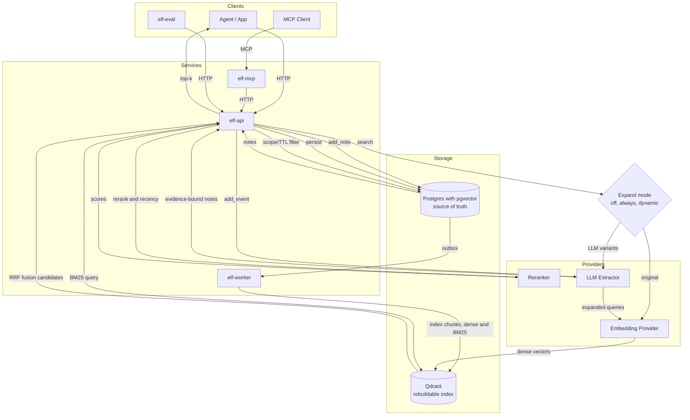

<div align="center">

# ELF

Evidence-linked fact memory for agents.

[](https://www.gnu.org/licenses/gpl-3.0)
[](https://github.com/hack-ink/ELF/actions/workflows/language.yml)
[](https://github.com/hack-ink/ELF/actions/workflows/release.yml)
[](https://github.com/hack-ink/ELF/tags)
[](https://github.com/hack-ink/ELF)
[](https://github.com/hack-ink/ELF)

</div>

## What Is ELF?

ELF is a memory service for LLM agents that stores short, evidence-linked facts and retrieves them with chunk-first hybrid search. Postgres with pgvector is the source of truth for notes and embeddings. Qdrant is a derived, rebuildable index for fast candidate retrieval. ELF exposes both HTTP and MCP interfaces.

## Project Goals

- Improve effective context usage with compact memory retrieval instead of replaying long history.
- Preserve correctness over time with update and lifecycle semantics, not append-only memory.
- Keep memory behavior auditable with deterministic boundaries, evidence, and replayable traces.
- Enable safe multi-agent collaboration through explicit scopes and sharing controls.
- Make quality measurable with repeatable evaluation and regression checks.

## Why Choose ELF

- Evidence-linked memory with strict provenance requirements.
- Deterministic `add_note` and LLM-driven `add_event` separation.
- Postgres source-of-truth plus rebuildable retrieval index.
- Chunk-first hybrid retrieval with expansion and rerank controls.
- Multi-tenant scoped APIs for service-style integration.
- Evaluation tooling (`elf-eval`) for retrieval quality and replay analysis.

## Quickstart

Use the canonical setup guide:

- `docs/guide/getting_started.md`

Fast path:

```sh
cp elf.example.toml elf.toml
psql "<dsn from elf.toml>" -f sql/init.sql
./qdrant/init.sh
cargo run -p elf-worker -- -c elf.toml
cargo run -p elf-api -- -c elf.toml
cargo run -p elf-mcp -- -c elf.toml
```

## Architecture



## Comparison

Detailed external comparison (memsearch, qmd, claude-mem, mem0), including mechanism-level analysis and source map:

- `docs/guide/comparison_external_projects.md`

Snapshot date in that document: February 17, 2026.

## Documentation

- Start here: `docs/index.md`
- Operational guide index: `docs/guide/index.md`
- Specifications: `docs/spec/index.md`
- System contract: `docs/spec/system_elf_memory_service_v2.md`
- Evaluation guide: `docs/guide/evaluation.md`
- Integration testing: `docs/guide/integration-testing.md`

## Development

```sh
cargo make fmt
cargo make lint
cargo make test
```

For integration and E2E workflows, use `docs/guide/getting_started.md` and `docs/guide/integration-testing.md`.

## Work Tracking

Implementation direction and sequencing are maintained in GitHub issues and issue comments.

## Support

If you find this project helpful and want to support its development:

- Ko-fi: https://ko-fi.com/hack_ink
- Afdian: https://afdian.com/a/hack_ink

- Bitcoin: `bc1pedlrf67ss52md29qqkzr2avma6ghyrt4jx9ecp9457qsl75x247sqcp43c`
- Ethereum: `0x3e25247CfF03F99a7D83b28F207112234feE73a6`
- Polkadot: `156HGo9setPcU2qhFMVWLkcmtCEGySLwNqa3DaEiYSWtte4Y`

## Appreciation

- The Rust community for continuous support and development of the ecosystem.

<div align="right">

### License

<sup>Licensed under [GPL-3.0](LICENSE).</sup>

</div>
