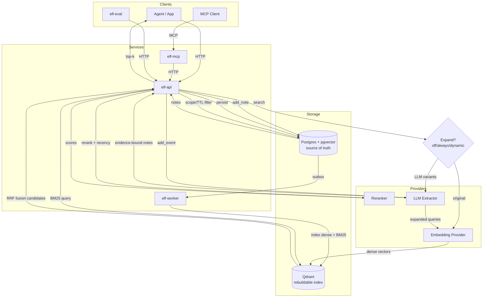

<div align="center">

# ELF

Evidence-linked fact memory for agents.

[](https://www.gnu.org/licenses/gpl-3.0)
[](https://github.com/hack-ink/ELF/actions/workflows/language.yml)
[](https://github.com/hack-ink/ELF/actions/workflows/release.yml)
[](https://github.com/hack-ink/ELF/tags)
[](https://github.com/hack-ink/ELF)
[](https://github.com/hack-ink/ELF)

</div>

## What Is ELF?

ELF is a memory service that stores short, evidence-linked facts for agents. It separates deterministic writes from LLM extraction, enforces evidence binding, and provides hybrid retrieval with configurable quality and cost controls. Postgres with pgvector is the source of truth; Qdrant is a derived index for fast candidate retrieval. ELF exposes HTTP and MCP interfaces for agent integrations.

## Why ELF

- Evidence-linked memory. Every extracted note includes verbatim evidence quotes.
- Deterministic ingestion. `add_note` never calls an LLM; `add_event` always does.
- Source-of-truth storage. Postgres is authoritative; Qdrant can be rebuilt at any time.
- Hybrid retrieval. Dense + BM25 candidate retrieval with optional reranking.
- Query expansion modes. `off`, `always`, or `dynamic` to balance recall and latency.
- Multi-tenant scoping. Tenant, project, agent, and scope boundaries are enforced.
- MCP integration. A dedicated `elf-mcp` server for Claude and other MCP clients.
- Evaluation-ready. `elf-eval` lets you measure retrieval quality quickly.

## Architecture



## Comparison (qmd, claude-mem)

Comparison focuses on shared capabilities plus ELF strengths.

### Interfaces And Integration

| Capability | ELF | qmd | claude-mem |
| --- | --- | --- | --- |
| Local-first, self-hosted memory | ✅ | ✅ | ✅ |
| MCP integration | ✅ | ✅ | ✅ |
| HTTP API service | ✅ | — | ✅ |
| CLI-first workflow | — | ✅ | — |
| Web UI viewer | — | — | ✅ |

### Retrieval Pipeline

| Capability | ELF | qmd | claude-mem |
| --- | --- | --- | --- |
| Full-text search (BM25 or FTS) | ✅ | ✅ | ✅ |
| Vector semantic search | ✅ | ✅ | ✅ |
| Hybrid dense + sparse fusion | ✅ | ✅ | ✅ |
| LLM reranking stage | ✅ | ✅ | — |
| Query expansion | ✅ | ✅ | — |
| Progressive disclosure workflow | — | — | ✅ |

### Quality, Safety, And Memory Semantics

| Capability | ELF | qmd | claude-mem |
| --- | --- | --- | --- |
| Evidence-bound notes (verbatim quotes) | ✅ | — | — |
| Deterministic vs LLM ingestion separation | ✅ | — | — |
| Source-of-truth DB with rebuildable index | ✅ | — | — |
| Multi-tenant scoping | ✅ | — | — |
| TTL and lifecycle policies | ✅ | — | — |
| English-only boundary enforcement | ✅ | — | — |
| Redaction on write | ✅ | — | — |

### Operations And Evaluation

| Capability | ELF | qmd | claude-mem |
| --- | --- | --- | --- |
| Retrieval evaluation CLI | ✅ | — | — |
| Structured JSON outputs | ✅ | ✅ | — |

### ELF-Only Advantages

- Evidence binding with verbatim quote checks.
- Postgres is the source of truth; vector index is fully rebuildable.
- Deterministic `add_note` and LLM-only `add_event` semantics.
- Query expansion modes (`off`, `always`, `dynamic`) for cost/latency control.
- Dedicated evaluation CLI to measure retrieval quality.

### Learnings Integrated

- Hybrid retrieval + rerank as a first-class pipeline, inspired by qmd's local hybrid stack.
- Progressive cost control for retrieval, informed by claude-mem's progressive disclosure approach.

## Quickstart

### Requirements

- Postgres with pgvector
- Qdrant
- Provider endpoints for embeddings, rerank, and extraction

### Run

```sh
cp elf.example.toml elf.toml
# Fill in providers and storage values in elf.toml

cargo run -p elf-worker -- -c elf.toml
cargo run -p elf-api -- -c elf.toml
cargo run -p elf-mcp -- -c elf.toml
```

### Evaluate

```sh
cargo run -p elf-eval -- -c elf.toml -i path/to/eval.json
```

## Configuration

See `elf.example.toml` and `docs/spec/system_elf_memory_service_v1.md` for the full contract. All config is explicit and required; no environment defaults are allowed. Embedding dimensions must match the Qdrant vector dimension.

## Development

```sh
cargo make fmt
cargo make lint
cargo make test
```

## Support

If you find this project helpful and want to support its development:

- Ko-fi: https://ko-fi.com/hack_ink
- Afdian: https://afdian.com/a/hack_ink

- Bitcoin: `bc1pedlrf67ss52md29qqkzr2avma6ghyrt4jx9ecp9457qsl75x247sqcp43c`
- Ethereum: `0x3e25247CfF03F99a7D83b28F207112234feE73a6`
- Polkadot: `156HGo9setPcU2qhFMVWLkcmtCEGySLwNqa3DaEiYSWtte4Y`

## Appreciation

- The Rust community for their continuous support and development of the Rust ecosystem.

<div align="right">

### License

<sup>Licensed under [GPL-3.0](LICENSE).</sup>

</div>
