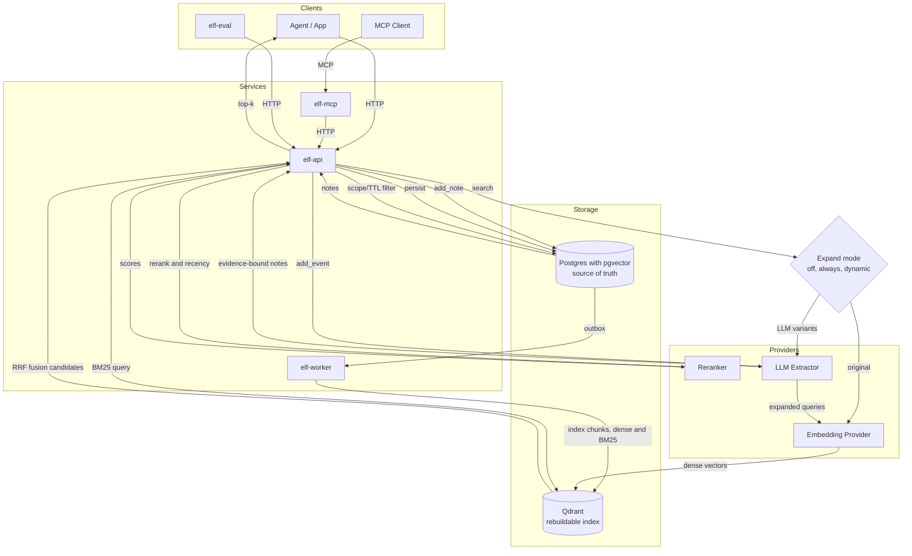

<div align="center">

# ELF

Evidence-linked fact memory for agents.

[](https://www.gnu.org/licenses/gpl-3.0)
[](https://github.com/hack-ink/ELF/actions/workflows/language.yml)
[](https://github.com/hack-ink/ELF/actions/workflows/release.yml)
[](https://github.com/hack-ink/ELF/tags)
[](https://github.com/hack-ink/ELF)
[](https://github.com/hack-ink/ELF)

</div>

## What Is ELF?

ELF is a memory service that stores short, evidence-linked facts for agents. It separates deterministic writes from LLM extraction, enforces evidence binding, and provides chunk-first hybrid retrieval with configurable quality and cost controls. Postgres with pgvector is the source of truth for notes and chunk embeddings; Qdrant is a derived, rebuildable chunk index for fast candidate retrieval. ELF exposes HTTP and MCP interfaces for agent integrations. The v2 HTTP API uses context headers (`X-ELF-Tenant-Id`, `X-ELF-Project-Id`, `X-ELF-Agent-Id`) to scope requests.

## Why ELF

- Evidence-linked memory. Every extracted note includes verbatim evidence quotes.
- Deterministic ingestion. `add_note` never calls an LLM; `add_event` always does.
- Source-of-truth storage. Postgres is authoritative; Qdrant can be rebuilt at any time.
- Chunk-first hybrid retrieval. Dense + BM25 candidate retrieval over token-aware chunks with optional reranking.
- Query expansion modes. `off`, `always`, or `dynamic` to balance recall and latency.
- Progressive disclosure search. `POST /v2/searches` returns a compact index; `POST /v2/searches/{search_id}/notes` fetches full notes and can record hits.
- Cost and debugging controls. Expansion and rerank caching plus search traces and explain endpoints.
- Multi-tenant scoping. Tenant, project, agent, and scope boundaries are enforced.
- MCP integration. A dedicated `elf-mcp` server for Claude and other MCP clients.
- Evaluation-ready. `elf-eval` lets you measure retrieval quality quickly.

## Architecture



## Comparison (memsearch, qmd, claude-mem, mem0)

Comparison focuses on shared capabilities plus ELF strengths. These projects solve adjacent problems, but their primary storage units and default workflows differ.

Legend:

- `✅`: Built-in and explicitly documented.
- `⚠️`: Partial, optional, transport-specific, or plugin-level support.
- `—`: Not explicitly documented in public docs/readme (as of February 12, 2026).

### Research Method And Confidence

- This comparison is documentation-grounded, not benchmark-grounded.
- Primary evidence is limited to official public READMEs and official docs from each project.
- A capability is marked `✅` only when explicitly documented as first-class behavior.
- A capability is marked `⚠️` when it exists but is optional, transport-specific, plugin-scoped, or requires extra configuration.
- A capability is marked `—` when no explicit public documentation was found during this review window.
- Snapshot date for all claims in this section: February 12, 2026.

Note: In this section, mem0 refers to the Mem0 ecosystem, including OpenMemory (an MCP memory server with a built-in UI).

### Scope And Intended Use

| Aspect             | ELF                                                   | [memsearch](https://github.com/zilliztech/memsearch) | [qmd](https://github.com/tobi/qmd) | [claude-mem](https://github.com/thedotmack/claude-mem) | [mem0](https://github.com/mem0ai/mem0) |
| ------------------ | ----------------------------------------------------- | ---------------------------------------------------- | ---------------------------------- | ------------------------------------------------------ | -------------------------------------- |
| Primary artifact   | Evidence-bound notes                                  | Markdown memory files + Milvus index                | Local Markdown index (chunks)      | Session observations and summaries                      | User, session, and agent memories      |
| Default write path | HTTP `POST /v2/notes/ingest` / `POST /v2/events/ingest` | CLI hooks + Python API (Markdown-first)             | CLI index + search                 | Auto-capture via Claude Code plugin hooks              | SDK/API (LLM-assisted)                 |
| Default deployment | API + worker + MCP server                             | Local package + Milvus (Lite/Server/Cloud) + plugin | Local CLI + MCP server             | Local plugin + worker + UI + MCP tools                 | SDK + hosted option; OpenMemory MCP server + UI |

### Interfaces And Integration

| Capability                      | ELF | memsearch | qmd | claude-mem | mem0 |
| ------------------------------- | --- | --------- | --- | ---------- | ---- |
| Local-first, self-hosted memory | ✅  | ✅        | ✅  | ✅         | ✅ (OpenMemory) |
| MCP integration                 | ✅  | ⚠️        | ✅  | ✅         | ✅ (OpenMemory) |
| HTTP API service                | ✅  | —         | ⚠️  | ✅         | ✅ (SDK/API) |
| CLI-first workflow              | —   | ✅        | ✅  | ⚠️         | —    |
| Web UI viewer                   | —   | —         | —   | ✅         | ✅ (OpenMemory) |
| Hosted option                   | —   | —         | —   | —          | ✅    |

### Retrieval Pipeline

| Capability                                  | ELF | memsearch | qmd | claude-mem | mem0 |
| ------------------------------------------- | --- | --------- | --- | ---------- | ---- |
| Full-text search (BM25/FTS/keyword modes)  | ✅  | ✅        | ✅  | ✅         | ⚠️   |
| Vector semantic search                      | ✅  | ✅        | ✅  | ✅         | ✅    |
| Hybrid dense + sparse fusion                | ✅  | ✅        | ✅  | ✅         | ⚠️   |
| LLM reranking stage                         | ✅  | —         | ✅  | —          | ⚠️   |
| Query expansion or query rewriting          | ✅  | —         | ✅  | —          | ⚠️   |
| Progressive disclosure workflow             | ✅  | ⚠️        | —   | ✅         | —    |

### Quality, Safety, And Memory Semantics

| Capability                                    | ELF | memsearch | qmd | claude-mem | mem0 |
| --------------------------------------------- | --- | --------- | --- | ---------- | ---- |
| Evidence-bound notes (verbatim quotes)        | ✅  | —         | —   | —          | —    |
| Deterministic vs LLM ingestion separation     | ✅  | —         | —   | —          | —    |
| Source-of-truth storage with rebuildable index | ✅  | ✅        | —   | —          | —    |
| Multi-tenant scoping                          | ✅  | —         | —   | —          | ✅    |
| TTL and lifecycle policies                    | ✅  | —         | —   | —          | ✅    |
| English-only boundary enforcement             | ✅  | —         | —   | —          | —    |
| Redaction or write-time exclusion controls    | ✅  | —         | —   | ⚠️         | ⚠️   |

### Operations And Evaluation

| Capability               | ELF | memsearch | qmd | claude-mem | mem0 |
| ------------------------ | --- | --------- | --- | ---------- | ---- |
| Retrieval evaluation CLI | ✅  | —         | —   | —          | —    |
| Structured JSON outputs  | ✅  | ⚠️        | ✅  | ✅         | ✅    |

Capability notes:

- qmd HTTP support is MCP Streamable HTTP (`POST /mcp`) rather than a separate REST memory API ([source](https://github.com/tobi/qmd?tab=readme-ov-file#streamable-http)).
- memsearch integration is currently plugin/CLI-centric; no standalone MCP server is documented ([source](https://github.com/zilliztech/memsearch)).
- memsearch progressive disclosure is described in the Claude plugin workflow docs, not as a generic service contract ([source](https://github.com/zilliztech/memsearch/tree/main/ccplugin)).
- mem0 search docs describe optional reranking, query optimization, and keyword-search toggles ([source](https://docs.mem0.ai/platform/features/search)).
- mem0 lifecycle docs describe `expiration_date` and automatic exclusion of expired memories from retrieval ([source](https://docs.mem0.ai/cookbooks/essentials/memory-expiration-short-and-long-term)).
- claude-mem supports `<private>` tags to exclude selected content from storage ([source](https://github.com/thedotmack/claude-mem?tab=readme-ov-file#memory-privacy-controls)).

### Project Strengths And Trade-offs

- [memsearch](https://github.com/zilliztech/memsearch): Strong Markdown-first transparency, smart dedup, and live file-watch sync. Trade-off: integration is centered on plugin/CLI workflows rather than a general MCP + HTTP service surface.
- [qmd](https://github.com/tobi/qmd): Strong local-first retrieval quality (BM25 + vector + rerank + query expansion) with practical CLI and MCP tooling. Trade-off: focused on document retrieval workflows more than memory-specific safety/lifecycle semantics.
- [claude-mem](https://github.com/thedotmack/claude-mem): Strong automatic capture and progressive disclosure UX, plus a practical local web viewer for inspection. Trade-off: optimized for Claude session continuity, with fewer explicit deterministic ingestion boundaries.
- [mem0](https://github.com/mem0ai/mem0): Strong ecosystem reach (SDK + hosted + OpenMemory), multi-entity scoping, and lifecycle controls like `expiration_date`. Trade-off: ingestion and retrieval behavior depends heavily on configurable LLM-assisted flows, which can be less deterministic by default.

### ELF-Only Advantages

- Evidence binding with verbatim quote checks.
- Postgres is the source of truth; vector index is fully rebuildable.
- Deterministic `add_note` and LLM-only `add_event` semantics.
- Query expansion modes (`off`, `always`, `dynamic`) for cost/latency control.
- Dedicated evaluation CLI to measure retrieval quality.

### What ELF Can Borrow Next

- Add an optional Markdown-native operating mode for teams that want direct file-level review and Git workflows.
- Provide a lightweight web memory viewer for local debugging and inspection.
- Expose first-class ingestion policy controls (for example, confidence gates and exclusion rules) as a documented API surface.
- Add lifecycle policy presets (for example, session memory expiry) on top of the existing TTL primitives.

## Quickstart

Agent-assisted setup: see [agent-setup guide](docs/guide/agent-setup.md).

### Requirements

- Postgres with pgvector
- Qdrant
- Provider endpoints for embeddings, rerank, and extraction

### Run

Copy `elf.example.toml` to `elf.toml`, then fill in provider and storage values. Initialize the Postgres schema and Qdrant collection once before starting the services. Start each service in a separate terminal.

```sh
cp elf.example.toml elf.toml
psql "<dsn from elf.toml>" -f sql/init.sql

# Qdrant REST endpoint (default: 6333). In this repository's local setup, it is often mapped to port 51889.
# ELF uses the gRPC endpoint at runtime (default: 6334, often mapped to port 51890).
export ELF_QDRANT_HTTP_URL="http://127.0.0.1:51889"
export ELF_QDRANT_COLLECTION="mem_notes_v2"
export ELF_QDRANT_VECTOR_DIM="4096"
./qdrant/init.sh

cargo run -p elf-worker -- -c elf.toml
cargo run -p elf-api -- -c elf.toml
cargo run -p elf-mcp -- -c elf.toml
```

### Evaluate

See `docs/guide/evaluation.md` for the dataset format and usage notes.

```sh
cargo run -p elf-eval -- -c elf.toml -i path/to/eval.json
```

## Configuration

See `elf.example.toml` and `docs/spec/system_elf_memory_service_v2.md` for the full contract. All config is explicit and required; no environment defaults are allowed. Embedding dimensions must match the Qdrant vector dimension. Search caching and explain trace retention are configured under `search.cache` and `search.explain`.

Chunking uses a Hugging Face tokenizer via the `tokenizers` crate. `chunking.tokenizer_repo` must be an explicit, non-empty repo name. In restricted or offline environments, set `chunking.tokenizer_repo` to a stable repo and ensure the worker can load it.

## Development

```sh
cargo make fmt
cargo make lint
cargo make test
cargo make test-integration
cargo make e2e
```

Notes:

- `cargo make test-integration` runs ignored tests that require external Postgres and Qdrant. Set `ELF_PG_DSN` and `ELF_QDRANT_URL`.
- `cargo make e2e` runs the context misranking harness. Set `ELF_PG_DSN`, `ELF_QDRANT_URL`, and `ELF_QDRANT_HTTP_URL`.

## Support

If you find this project helpful and want to support its development:

- Ko-fi: https://ko-fi.com/hack_ink
- Afdian: https://afdian.com/a/hack_ink

- Bitcoin: `bc1pedlrf67ss52md29qqkzr2avma6ghyrt4jx9ecp9457qsl75x247sqcp43c`
- Ethereum: `0x3e25247CfF03F99a7D83b28F207112234feE73a6`
- Polkadot: `156HGo9setPcU2qhFMVWLkcmtCEGySLwNqa3DaEiYSWtte4Y`

## Appreciation

- The Rust community for their continuous support and development of the Rust ecosystem.

<div align="right">

### License

<sup>Licensed under [GPL-3.0](LICENSE).</sup>

</div>
