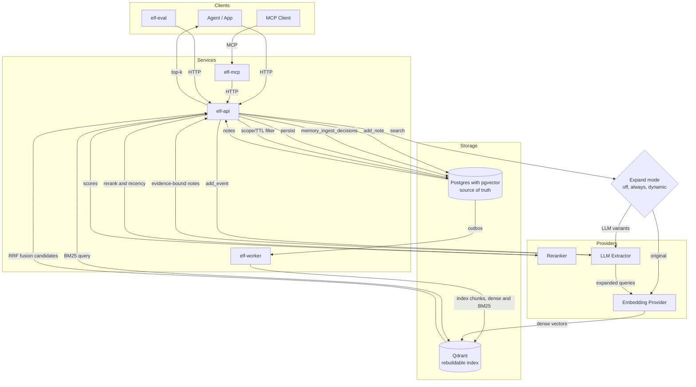

<div align="center">

# ELF

Evidence-linked fact memory for agents.

[](https://www.gnu.org/licenses/gpl-3.0)
[](https://github.com/hack-ink/ELF/actions/workflows/language.yml)
[](https://github.com/hack-ink/ELF/actions/workflows/release.yml)
[](https://github.com/hack-ink/ELF/tags)
[](https://github.com/hack-ink/ELF)
[](https://github.com/hack-ink/ELF)

</div>

## What Is ELF?

ELF is a memory service for LLM agents that stores short, evidence-linked facts and retrieves them with chunk-first hybrid search. Postgres with pgvector is the source of truth for notes and embeddings. Qdrant is a derived, rebuildable index for fast candidate retrieval. ELF can also persist evidence-bound entity/relation facts and optionally attach them as `relation_context` in search explain output. ELF exposes both HTTP and MCP interfaces.

## Project Goals

- Improve effective context usage with compact memory retrieval instead of replaying long history.
- Preserve correctness over time with update and lifecycle semantics, not append-only memory.
- Keep memory behavior auditable with deterministic boundaries, evidence, and replayable traces.
- Enable safe multi-agent collaboration through explicit scopes and sharing controls.
- Make quality measurable with repeatable evaluation and regression checks.

## Why Choose ELF

- Evidence-linked memory with strict provenance requirements.
- Deterministic `add_note` and LLM-driven `add_event` separation.
- Postgres source-of-truth plus rebuildable retrieval index.
- Chunk-first hybrid retrieval with expansion and rerank controls.
- Multi-tenant scoped APIs for service-style integration.
- Evaluation tooling (`elf-eval`) for retrieval quality and replay analysis.

## Quickstart

Use the canonical setup guide:

- `docs/guide/getting_started.md`
- For single-user production operation, backup, restore, and Qdrant rebuild, use
  [docs/guide/single_user_production.md](docs/guide/single_user_production.md).

Fast path:

```sh
docker compose -f docker-compose.yml up -d postgres qdrant

# Terminal 1
cargo run -p elf-api -- -c config/local/elf.docker.toml

# Terminal 2
cargo run -p elf-worker -- -c config/local/elf.docker.toml

# Terminal 3
curl -fsS http://127.0.0.1:51892/health
```

For provider-backed development, copy `elf.example.toml` to `elf.toml` and fill the provider blocks.
For production use, do not rely on these quickstart commands; follow the single-user
production runbook linked above so backup, restore, rollback, and provider config
handling are explicit.

## Architecture


```mermaid
flowchart TB
  subgraph Clients
    Agent[Agent / App]
    MCPClient[MCP Client]
    Eval[elf-eval]
  end

  subgraph Services
    API[elf-api]
    MCP[elf-mcp]
    Worker[elf-worker]
  end

  subgraph Storage
    PG[(Postgres with pgvector<br/>source of truth)]
    Qdrant[(Qdrant<br/>rebuildable index)]
  end

  subgraph Providers
    Embed[Embedding Provider]
    Rerank[Reranker]
    Extractor[LLM Extractor]
  end

  Agent -->|HTTP| API
  MCPClient -->|MCP| MCP
  MCP -->|HTTP| API
  Eval -->|HTTP| API

  API -->|add_note| PG
  API -->|memory_ingest_decisions| PG
  API -->|add_event| Extractor
  Extractor -->|evidence-bound notes| API
  API -->|persist| PG
  PG -->|outbox| Worker
  Worker -->|index chunks, dense and BM25| Qdrant

  API -->|search| Expand{Expand mode<br/>off, always, dynamic}
  Expand -->|original| Embed
  Expand -->|LLM variants| Extractor
  Extractor -->|expanded queries| Embed
  Embed -->|dense vectors| Qdrant
  API -->|BM25 query| Qdrant
  Qdrant -->|RRF fusion candidates| API
  API -->|scope/TTL filter| PG
  PG -->|notes| API
  API -->|rerank and recency| Rerank
  Rerank -->|scores| API
  API -->|top-k| Agent
```

## Comparison

### Checked-In Live Benchmark Snapshot

The June 9, 2026 Docker-only live baseline and production adoption gate, plus the
June 10 post-adapter adoption refresh, use generated corpus/query manifests across ELF
and the external memory projects below. ELF was run with the production embedding
provider path, `Qwen3-Embedding-8B`, and 4096-dimensional embeddings where
provider-backed ELF evidence was required.

- Production adoption gate verdict: ELF is ready for personal production use with
  bounded caveats. The private production corpus profile was not run because no
  operator-owned private manifest was available; the task failed closed at the missing
  manifest guard, so no private-corpus pass is claimed.
- Post-adapter production adoption refresh verdict: keep adopting ELF for personal
  production use with bounded caveats. The full live real-world sweep, OpenViking
  dependency refresh, and RAG/graph research gates sharpen the limits but do not
  create a new production blocker.
- ELF production-provider synthetic run: 8 documents, 6 queries, `8/8` encoded checks,
  `retrieval_pass`, and `pass` in 59 seconds.
- ELF production-provider stress run: 480 documents, 16 queries, `9/9` encoded checks,
  `retrieval_pass`, and `pass` in 779 seconds.
- ELF production-provider backfill run: 2,000 documents, 16 queries, `9/9` encoded
  checks, resume from 1,000 to 2,000 imported documents, zero duplicate source notes,
  and `pass` in 2,804 seconds.
- Single-user production restore proof: Docker Compose backup/restore plus Qdrant
  rebuild returned `rebuilt_count=1`, `missing_vector_count=0`, `error_count=0`, and
  search recovered the restored note.
- Fresh all-project smoke run: ELF and qmd passed every encoded check. agentmemory
  passed same-corpus retrieval but failed lifecycle/cold-start coverage. memsearch,
  mem0, OpenViking, and claude-mem remained typed non-pass states. OpenViking now
  reaches its pinned Docker local embedding path and is reported as `wrong_result`
  when same-corpus evidence terms are missed; setup failures remain `incomplete`.
- Real-world agent memory aggregate after the P1 benchmark batch: 40 fixture-backed
  jobs across 11 suites, 38 pass, 0 incomplete, 2 blocked, 0 wrong-result,
  0 not-encoded, and 0 unsupported-claim results. The remaining non-pass jobs are
  production-ops operator boundaries, not hidden benchmark wins.
- Full-suite live real-world adapter sweep after XY-899: ELF and qmd emit
  Docker-isolated `live_real_world` records for all 40 encoded jobs across 11 suites
  through `cargo make real-world-memory-live-adapters`. Both keep the original
  targeted `work_resume`, `retrieval`, and `project_decisions` slice passing, but the
  full sweep is not a full-suite pass. The fresh ELF sweep reports 22 pass,
  5 wrong_result, 2 blocked, and 11 not_encoded jobs. The fresh qmd sweep reports
  17 pass, 6 wrong_result, 2 blocked, and 15 not_encoded jobs. The differences are
  the delete/TTL tombstone case plus ELF-only capture/write-policy live self-checks;
  qmd remains the local retrieval-debug UX reference, and no broad ELF-over-qmd claim
  is allowed.
- Live operator-debugging slice after XY-932: `cargo make
  real-world-job-operator-ux-live-adapters` emits narrow Docker-isolated
  `live_real_world` records for ELF and qmd over the operator-debugging fixtures.
  ELF passes trace hydration, candidate-drop visibility, selected-but-not-narrated
  evidence, replay-command availability, and repair-action clarity. qmd ties replay
  command and repair-action clarity but is `wrong_result` for trace hydration and
  candidate-drop stage visibility. OpenMemory UI/export and claude-mem viewer flows
  remain blocked or not encoded, so this is not a broad viewer-product claim.
- Expanded adapter-pack coverage after XY-834: the real-world external adapter
  manifest now includes `research_gate` records for RAGFlow, LightRAG, GraphRAG,
  Graphiti/Zep, Letta, LangGraph, nanograph, llm-wiki, gbrain, and deeper
  qmd/OpenViking profiles, while graphify now has a scored tiny Docker smoke record.
  These records carry source/setup/runtime/resource/retry metadata and typed
  `blocked`, `incomplete`, `wrong_result`, or `not_encoded` states; they are not
  fixture-backed or live adapter pass evidence.
- Graph/RAG scored-smoke promotion after XY-900: RAGFlow, LightRAG, GraphRAG,
  Graphiti/Zep, and graphify smokes now emit scored or typed non-pass
  `real_world_job` adapter reports when run. graphify currently reaches a tiny Docker
  graph/report smoke and scores `wrong_result`; the other in-scope projects remain
  typed blocked or incomplete without explicit service, resource, or provider setup.
  These reports preserve the smoke-only boundary and do not create an ELF win claim
  against graph/RAG strengths.
- mem0/OpenMemory history follow-up after XY-924 and XY-931: the local OSS mem0
  adapter now passes encoded preference correction history, entity-scoped
  personalization, local `get_all` export-style readback, and deletion audit history.
  The separate OpenMemory export-helper setup probe in `live-baseline-20260611122416`
  records `blocked` with `DOCKER_UNAVAILABLE_IN_BASELINE_RUNNER`, so SDK `get_all`
  is still not UI/export evidence. The comparison records ELF as a loss on preference
  correction history, ties on scoped personalization and delete audit, `not_tested`
  for local SDK export-style parity, `blocked` for OpenMemory UI/export, and
  `non_goal` for hosted Platform export and optional graph memory in the local OSS
  lane.
- Capture/write-policy live follow-up after XY-933: ELF now passes 4/4 live
  `capture_integration` jobs with zero redaction leaks, source ids preserved in
  source refs, write-policy redaction audit counts, evidence binding, and no secret
  leakage. qmd remains `not_encoded` for this suite. agentmemory capture comparison is
  blocked by mocked/in-memory storage, and claude-mem hook/viewer capture remains
  untested, so no broad capture-breadth superiority claim is allowed.
- The benchmark runner and report publisher are checked in and Docker-isolated:
  `cargo make baseline-live-docker`, `cargo make baseline-backfill-docker`,
  `cargo make baseline-production-private-addendum`,
  `cargo make baseline-backfill-10k-docker`,
  `cargo make baseline-backfill-100k-docker`,
  `cargo make baseline-soak-docker`, `cargo make baseline-live-report`,
  `cargo make real-world-memory-live-adapters`, and
  `cargo make baseline-live-docker-clean`. Expensive 100k and long-soak profiles
  are opt-in and do not run in normal checks.

Detailed evidence and interpretation:

- [Live Baseline Benchmark Report - June 9, 2026](docs/guide/benchmarking/2026-06-09-live-baseline-report.md)
- [Synthetic Production Corpus Benchmark Report - June 9, 2026](docs/guide/benchmarking/2026-06-09-production-corpus-report.md)
- [Production Adoption Gate Report - June 9, 2026](docs/guide/benchmarking/2026-06-09-production-adoption-gate-report.md)
- [Real-World Comparison Report - June 10, 2026](docs/guide/benchmarking/2026-06-10-real-world-comparison-report.md)
- [Live Real-World Adapter Sweep Report - June 10, 2026](docs/guide/benchmarking/2026-06-10-live-real-world-sweep-report.md)
- [Post-Adapter Production Adoption Refresh - June 10, 2026](docs/guide/benchmarking/2026-06-10-production-adoption-refresh.md)
- [qmd and OpenViking Strength-Profile Report - June 11, 2026](docs/guide/benchmarking/2026-06-11-qmd-openviking-strength-profile-report.md)
- [ELF/qmd Trace Replay Diagnostics Report - June 11, 2026](docs/guide/benchmarking/2026-06-11-elf-qmd-trace-replay-diagnostics-report.md)
- [Graph/RAG Scored Smoke Adapter Report - June 11, 2026](docs/guide/benchmarking/2026-06-11-graph-rag-scored-smoke-adapter-report.md)
- [mem0/OpenMemory History and UI Export Report - June 11, 2026](docs/guide/benchmarking/2026-06-11-mem0-openmemory-history-ui-export-report.md)
- [Capture/Write-Policy Live Report - June 11, 2026](docs/guide/benchmarking/2026-06-11-capture-write-policy-live-report.md)
- [Live Baseline Benchmark Runbook](docs/guide/benchmarking/live_baseline_benchmark.md)
- [Single-User Production Runbook](docs/guide/single_user_production.md)
- Benchmark contract:
  [Real-World Agent Memory Benchmark v1](docs/spec/real_world_agent_memory_benchmark_v1.md).
  This contract defines job-level suites for agent work. `cargo make real-world-memory`
  now reports fixture-backed ELF evidence plus the external adapter coverage manifest
  for the first memory-project set plus expanded RAG and graph-memory research gates.
  The report still distinguishes fixture-backed, live-baseline-only, research-gate,
  and true live real-world adapter evidence; ELF and qmd now execute a full encoded
  live sweep, but that sweep still contains typed non-pass states and is not
  full-suite parity.

Evidence-backed position after the June 11 real-world reports:

- ELF is better evidenced than the tested alternatives on evidence-bound writes,
  deterministic ingestion boundaries, Postgres source-of-truth plus rebuildable Qdrant
  indexing, scoped service APIs, and fixture-backed provenance/resume/evolution checks.
- ELF and qmd are both strong in the current encoded retrieval evidence: qmd remains
  the local retrieval-debug baseline and now has full-suite live sweep evidence with
  typed non-pass states, while ELF has the stronger service and provenance contract.
- ELF is still behind or not yet proven on full-suite live real-world pass parity,
  private-corpus production quality, credentialed production-ops gates,
  qmd-style local debug knobs, agentmemory/claude-mem/OpenMemory-style capture and
  continuity UX,
  OpenViking-style context trajectory, and hosted managed memory.

Quick comparison snapshot (objective/high-level).
This table compares capability coverage, not overall project quality.

| Capability | ELF | agentmemory | OpenViking | mem0 | qmd | claude-mem | memsearch |
| ---------- | --- | ----------- | ---------- | ---- | --- | ---------- | --------- |
| Local-first self-hosted workflow | ✅ | ✅ | ✅ | ✅ (OpenMemory) | ✅ | ✅ | ✅ |
| MCP integration | ✅ | ✅ | — | ✅ (OpenMemory) | ✅ | ✅ | ⚠️ |
| CLI-first developer workflow | — | ✅ | ✅ | — | ✅ | ⚠️ | ✅ |
| HTTP API service surface | ✅ | ✅ | ✅ | ✅ | ⚠️ (MCP Streamable HTTP) | ✅ | — |
| Query expansion or query rewriting | ✅ | ⚠️ | ✅ | ⚠️ | ✅ | — | — |
| LLM reranking stage | ✅ | ⚠️ | ⚠️ | ⚠️ | ✅ | — | — |
| Hybrid dense + sparse retrieval | ✅ | ✅ | ✅ | ⚠️ | ✅ | ✅ | ✅ |
| Progressive disclosure style retrieval | ✅ | ⚠️ | ✅ | — | — | ✅ | ⚠️ |
| Evidence-bound memory writes | ✅ | — | — | — | — | — | — |
| Deterministic and LLM-ingestion boundary | ✅ | ⚠️ | ⚠️ | ⚠️ | — | — | — |
| Source-of-truth + rebuildable derived index | ✅ | ⚠️ | ✅ | ⚠️ | ⚠️ | ⚠️ | ✅ |
| Hierarchical/recursive retrieval strategy | ⚠️ (in progress) | ⚠️ | ✅ | ⚠️ | ⚠️ | ⚠️ | ⚠️ |
| Progressive context loading (L0/L1/L2 style) | ⚠️ (in progress) | ⚠️ | ✅ | ⚠️ | — | ⚠️ | — |
| Built-in web memory inspector/viewer | ✅ | ✅ | — | ✅ (OpenMemory) | — | ✅ | — |
| Hosted managed option | — | — | — | ✅ | — | — | — |
| Multi-tenant scope semantics | ✅ | ⚠️ | ⚠️ | ✅ | — | — | — |
| TTL/lifecycle policy controls | ✅ | ⚠️ | ⚠️ | ✅ | — | ⚠️ | — |
| Graph memory mode | ⚠️ (graph-lite: structured relations persisted; optional search `relation_context`) | ⚠️ | ⚠️ (URI-link relations) | ✅ (optional) | — | — | — |

Legend: `✅` built-in and documented; `⚠️` partial, optional, or in-progress; `—` not a first-class documented capability.

Project signature strengths (what each does especially well):

| Project | Signature strengths | Potential ELF adoption value |
| ------- | ------------------- | ---------------------------- |
| ELF | Evidence-bound writes, deterministic ingestion boundary, SoT + rebuildable index, eval tooling | Keep as core differentiators while extending retrieval and UX |
| agentmemory | Cross-agent hooks, MCP/REST packaging, local viewer, iii console observability, coding-agent continuity benchmarks | Use as adapter/baseline and UX reference, not a replacement for ELF provenance semantics |
| OpenViking | Filesystem-like context model (`viking://`), hierarchical retrieval, staged retrieval trajectory | Improve query planning, recursive retrieval, and explainable stage outputs |
| mem0 | Broad ecosystem (SDK + hosted + OpenMemory), multi-entity scope, lifecycle + optional graph memory | Strengthen event/history APIs and additive graph context channel |
| qmd | High-quality local retrieval pipeline (query expansion + weighted fusion + rerank), strong CLI/MCP workflow | Borrow transparent routing/fusion knobs and local debugging ergonomics |
| claude-mem | Progressive disclosure UX, automatic capture loop, practical local viewer/inspection workflow | Add operator-facing viewer/status/trace surfaces for faster tuning |
| memsearch | Markdown-first canonical store, incremental reindex, practical hybrid retrieval | Reinforce ingest/index consistency and developer-friendly local workflows |

Detailed comparison, mechanism-level analysis, and source map:

- [Live Baseline Benchmark Report - June 9, 2026](docs/guide/benchmarking/2026-06-09-live-baseline-report.md)
- [Synthetic Production Corpus Benchmark Report - June 9, 2026](docs/guide/benchmarking/2026-06-09-production-corpus-report.md)
- [Production Adoption Gate Report - June 9, 2026](docs/guide/benchmarking/2026-06-09-production-adoption-gate-report.md)
- [Real-World Comparison Report - June 10, 2026](docs/guide/benchmarking/2026-06-10-real-world-comparison-report.md)
- [Live Real-World Adapter Sweep Report - June 10, 2026](docs/guide/benchmarking/2026-06-10-live-real-world-sweep-report.md)
- [Post-Adapter Production Adoption Refresh - June 10, 2026](docs/guide/benchmarking/2026-06-10-production-adoption-refresh.md)
- [Competitor Strength Evidence Matrix - June 11, 2026](docs/guide/benchmarking/2026-06-11-competitor-strength-evidence-matrix.md)
- [Temporal History Competitor Gap Report - June 11, 2026](docs/guide/benchmarking/2026-06-11-temporal-history-competitor-gap-report.md)
- [ELF/qmd Trace Replay Diagnostics Report - June 11, 2026](docs/guide/benchmarking/2026-06-11-elf-qmd-trace-replay-diagnostics-report.md)
- [Graph/RAG Scored Smoke Adapter Report - June 11, 2026](docs/guide/benchmarking/2026-06-11-graph-rag-scored-smoke-adapter-report.md)
- [mem0/OpenMemory History and UI Export Report - June 11, 2026](docs/guide/benchmarking/2026-06-11-mem0-openmemory-history-ui-export-report.md)
- [Capture/Write-Policy Live Report - June 11, 2026](docs/guide/benchmarking/2026-06-11-capture-write-policy-live-report.md)
- [Live Baseline Benchmark Runbook](docs/guide/benchmarking/live_baseline_benchmark.md)
- [Real-World Agent Memory Benchmark](docs/guide/benchmarking/real_world_agent_memory_benchmark.md)
- [External Memory Improvement Plan](docs/guide/research/external_memory_improvement_plan.md)
- [Detailed External Comparison](docs/guide/research/comparison_external_projects.md)
- [Research Projects Inventory](docs/guide/research/research_projects_inventory.md)
- [Agent Memory Selection Research Run](docs/research/2026-06-08-agent-memory-selection.json)
- [Real-World Benchmark Dimension Research Run](docs/research/2026-06-09-xy-841-external-memory-benchmark-dimensions.json)
- [RAG/Graph Adapter Feasibility Research Run](docs/research/2026-06-10-xy-882-rag-graph-adapter-feasibility.json)

Latest real-world benchmark report: June 11, 2026. Latest external research refresh:
June 11, 2026.

## Documentation

- Start here: `docs/index.md`
- Operational guide index: `docs/guide/index.md`
- Single-user production runbook:
  [docs/guide/single_user_production.md](docs/guide/single_user_production.md)
- Benchmarking guides and reports: `docs/guide/benchmarking/index.md`
- Research index: `docs/guide/research/index.md`
- Specifications: `docs/spec/index.md`
- System contract: `docs/spec/system_elf_memory_service_v2.md`
- Ingest policy: `policy_decision` values (`remember`, `update`, `ignore`, `reject`) are returned for each note result in `add_note` and `add_event`.
- All ingest decisions are also written to `memory_ingest_decisions` with policy inputs and thresholds for auditability.
- Evaluation guide: `docs/guide/evaluation.md`
- Integration testing: `docs/guide/integration-testing.md`

## Development

```sh
cargo make fmt
cargo make lint
cargo make test
```

For integration and E2E workflows, use `docs/guide/getting_started.md` and `docs/guide/integration-testing.md`.

## Support Me

If you find this project helpful and would like to support its development, you can buy me a coffee!

Your support is greatly appreciated and motivates me to keep improving this project.

- **Fiat**
    - [Ko-fi](https://ko-fi.com/hack_ink)
    - [Afdian](https://afdian.com/a/hack_ink)
- **Crypto**
    - **Bitcoin**
        - `bc1pedlrf67ss52md29qqkzr2avma6ghyrt4jx9ecp9457qsl75x247sqcp43c`
    - **Ethereum**
        - `0x3e25247CfF03F99a7D83b28F207112234feE73a6`
    - **Polkadot**
        - `156HGo9setPcU2qhFMVWLkcmtCEGySLwNqa3DaEiYSWtte4Y`

Thank you for your support!

## Appreciation

We would like to extend our heartfelt gratitude to the following projects and contributors:

- The Rust community for their continuous support and development of the Rust ecosystem.

## Additional Acknowledgements

- None.

<div align="right">

### License

<sup>Licensed under [GPL-3.0](LICENSE).</sup>

</div>
