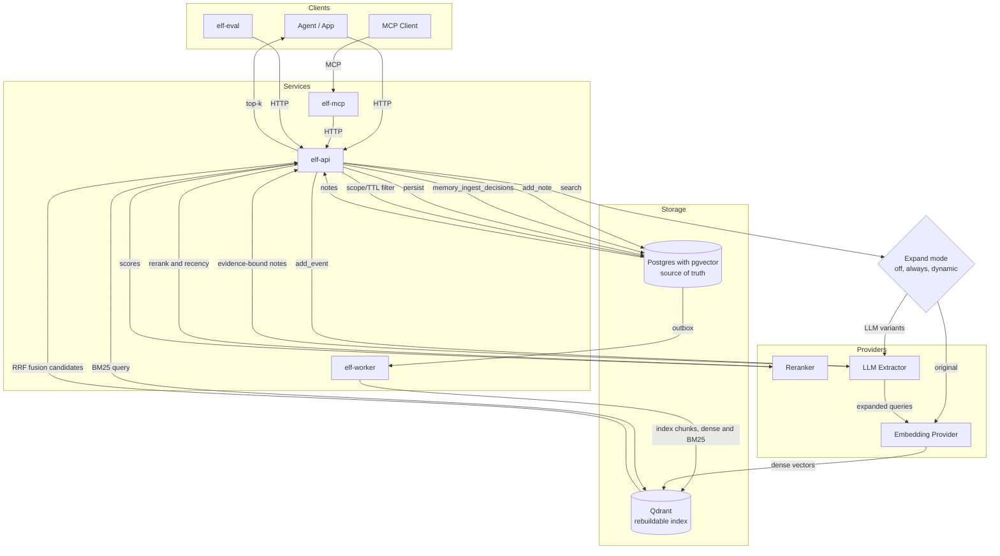

<div align="center">

# ELF

Evidence-linked fact memory for agents.

[](https://www.gnu.org/licenses/gpl-3.0)
[](https://github.com/hack-ink/ELF/actions/workflows/language.yml)
[](https://github.com/hack-ink/ELF/actions/workflows/release.yml)
[](https://github.com/hack-ink/ELF/tags)
[](https://github.com/hack-ink/ELF)
[](https://github.com/hack-ink/ELF)

</div>

## What Is ELF?

ELF is a memory service for LLM agents that stores short, evidence-linked facts and retrieves them with chunk-first hybrid search. Postgres with pgvector is the source of truth for notes and embeddings. Qdrant is a derived, rebuildable index for fast candidate retrieval. ELF can also persist evidence-bound entity/relation facts and optionally attach them as `relation_context` in search explain output. ELF exposes both HTTP and MCP interfaces.

## Project Goals

- Improve effective context usage with compact memory retrieval instead of replaying long history.
- Preserve correctness over time with update and lifecycle semantics, not append-only memory.
- Keep memory behavior auditable with deterministic boundaries, evidence, and replayable traces.
- Enable safe multi-agent collaboration through explicit scopes and sharing controls.
- Make quality measurable with repeatable evaluation and regression checks.

## Why Choose ELF

- Evidence-linked memory with strict provenance requirements.
- Deterministic `add_note` and LLM-driven `add_event` separation.
- Postgres source-of-truth plus rebuildable retrieval index.
- Chunk-first hybrid retrieval with expansion and rerank controls.
- Multi-tenant scoped APIs for service-style integration.
- Evaluation tooling (`elf-eval`) for retrieval quality and replay analysis.

## Quickstart

Use the canonical setup runbook:

- `docs/runbook/getting_started.md`
- For single-user production operation, backup, restore, and Qdrant rebuild, use
  [docs/runbook/single_user_production.md](docs/runbook/single_user_production.md).

Fast path:

```sh
docker compose -f docker-compose.yml up -d postgres qdrant

# Terminal 1
cargo run -p elf-api -- -c config/local/elf.docker.toml

# Terminal 2
cargo run -p elf-worker -- -c config/local/elf.docker.toml

# Terminal 3
curl -fsS http://127.0.0.1:51892/health
```

For provider-backed development, copy `elf.example.toml` to `elf.toml` and fill the provider blocks.
For production use, do not rely on these quickstart commands; follow the single-user
production runbook linked above so backup, restore, rollback, and provider config
handling are explicit.

## Architecture


```mermaid
flowchart TB
  subgraph Clients
    Agent[Agent / App]
    MCPClient[MCP Client]
    Eval[elf-eval]
  end

  subgraph Services
    API[elf-api]
    MCP[elf-mcp]
    Worker[elf-worker]
  end

  subgraph Storage
    PG[(Postgres with pgvector<br/>source of truth)]
    Qdrant[(Qdrant<br/>rebuildable index)]
  end

  subgraph Providers
    Embed[Embedding Provider]
    Rerank[Reranker]
    Extractor[LLM Extractor]
  end

  Agent -->|HTTP| API
  MCPClient -->|MCP| MCP
  MCP -->|HTTP| API
  Eval -->|HTTP| API

  API -->|add_note| PG
  API -->|memory_ingest_decisions| PG
  API -->|add_event| Extractor
  Extractor -->|evidence-bound notes| API
  API -->|persist| PG
  PG -->|outbox| Worker
  Worker -->|index chunks, dense and BM25| Qdrant

  API -->|search| Expand{Expand mode<br/>off, always, dynamic}
  Expand -->|original| Embed
  Expand -->|LLM variants| Extractor
  Extractor -->|expanded queries| Embed
  Embed -->|dense vectors| Qdrant
  API -->|BM25 query| Qdrant
  Qdrant -->|RRF fusion candidates| API
  API -->|scope/TTL filter| PG
  PG -->|notes| API
  API -->|rerank and recency| Rerank
  Rerank -->|scores| API
  API -->|top-k| Agent
```

## Comparison

### Checked-In Live Benchmark Snapshot

The June 9, 2026 Docker-only live baseline and production adoption gate, plus the
June 10 post-adapter adoption refresh, use generated corpus/query manifests across ELF
and the external memory projects below. ELF was run with the production embedding
provider path, `Qwen3-Embedding-8B`, and 4096-dimensional embeddings where
provider-backed ELF evidence was required.

- Production adoption gate verdict: ELF is ready for personal production use with
  bounded caveats. The private production corpus profile was not run because no
  operator-owned private manifest was available; the task failed closed at the missing
  manifest guard, so no private-corpus pass is claimed.
- Post-adapter production adoption refresh verdict: keep adopting ELF for personal
  production use with bounded caveats. The full live real-world sweep, OpenViking
  dependency refresh, and RAG/graph research gates sharpen the limits but do not
  create a new production blocker.
- ELF production-provider synthetic run: 8 documents, 6 queries, `8/8` encoded checks,
  `retrieval_pass`, and `pass` in 59 seconds.
- ELF production-provider stress run: 480 documents, 16 queries, `9/9` encoded checks,
  `retrieval_pass`, and `pass` in 779 seconds.
- ELF production-provider backfill run: 2,000 documents, 16 queries, `9/9` encoded
  checks, resume from 1,000 to 2,000 imported documents, zero duplicate source notes,
  and `pass` in 2,804 seconds.
- Single-user production restore proof: Docker Compose backup/restore plus Qdrant
  rebuild returned `rebuilt_count=1`, `missing_vector_count=0`, `error_count=0`, and
  search recovered the restored note.
- Fresh all-project smoke run: ELF and qmd passed every encoded check. agentmemory
  passed same-corpus retrieval but failed lifecycle/cold-start coverage. mem0/OpenMemory
  and memsearch now pass their scoped local baseline smokes, while OpenMemory
  UI/export, hosted mem0 Platform, optional graph memory, and broader memsearch prompt
  and TTL coverage remain blocked, unsupported, or not encoded. OpenViking now reaches
  its pinned Docker local embedding path and is reported as `wrong_result` when
  same-corpus evidence terms are missed; claude-mem and OpenViking non-retrieval
  coverage remain typed non-pass states.
- Real-world agent memory aggregate after XY-954: 60 fixture-backed
  jobs across 16 suites, 53 pass, 0 incomplete, 7 blocked, 0 wrong-result,
  0 not-encoded, and 0 unsupported-claim results. The remaining non-pass jobs are
  production-ops operator boundaries plus blocked OpenViking staged trajectory,
  hierarchy selection, recursive/context expansion measurement gates, and the
  private-corpus/private-provider scheduler blockers tied to XY-930, not hidden benchmark wins. The
  `scheduled_memory` suite contributes four passing source-linked scheduled task
  readbacks plus one typed private/provider scheduler blocker tied to XY-930. The
  `core_archival_memory` suite passes 6 fixture jobs for core block attachment, scope,
  provenance, stale-core detection, archival fallback, and project-decision recovery;
  it does not create an ELF-over-Letta claim. The
  `memory_summary` fixture passes 1 source-trace job for reviewable top-of-mind,
  background, stale, superseded, tombstoned, and derived project-profile entries; it
  does not create a managed-memory parity claim. The new `proactive_brief` fixture
  scores 5 jobs, with 4 pass and 1 blocked private-corpus case; it does not create
  Pulse or hosted managed-memory parity.
- Dreaming competitor-strength closeout after XY-955: the June 17 competitor-strength closeout
  retest keeps ELF
  locally and partially stronger only. The aggregate fixture retest remains 53 pass
  and 7 typed blockers, the representative graph/RAG slice remains typed non-pass,
  first-generation OSS fixture coverage remains 4 pass and 2 blocked, and the fresh
  full live-adapter rerun reports ELF at 40 pass/0 wrong_result versus qmd at 17
  pass/13 wrong_result while preserving qmd's separate debug-ergonomics edge. This
  rejects broad superiority claims and leaves qmd debug ergonomics,
  OpenViking trajectory, Letta core/archive, graph/RAG quality, and XY-930
  private/provider gates as follow-up work.
- qmd debug-ergonomics retest after XY-982: the June 19 operator-debug live retest
  keeps the qmd edge unchanged. ELF scores 6 pass/0 wrong_result with trace and
  candidate-drop visibility across all six jobs, while qmd keeps replay commands on
  all six jobs but records 0 pass/6 wrong_result because service trace hydration and
  intermediate candidate-drop stages are not exposed. This confirms ELF's narrow
  trace/stage visibility wins without erasing qmd's default top-k JSON and short CLI
  replay advantage.
- OpenViking trajectory materialization after XY-983: the June 19 context-trajectory
  follow-up now has a dedicated repo task,
  `cargo make real-world-memory-context-trajectory`, and a checked-in report
  snapshot. The slice materializes 3 OpenViking trajectory/hierarchy/recursive jobs
  as 0 pass, 0 wrong_result, and 3 typed blockers with 9/9 evidence coverage. This
  improves auditability but does not remove the OpenViking context-trajectory gap or
  support any ELF win, tie, or loss claim on those strengths.
- Letta core/archive materialization after XY-984: the June 19 follow-up adds
  `cargo make smoke-letta-core-archive-export-readback`, a Docker-contained
  materialization/report command for the six `core_archival_memory` scenarios. The
  default run scores 0 pass, 0 wrong_result, and 6 typed blockers with 14/14 evidence,
  source-ref, and quote coverage. This improves the Letta audit path but keeps the
  competitive status unchanged: no ELF-over-Letta win, tie, or loss is allowed until
  exported Letta core block JSON, archival readback/search JSON, and fixture source ids
  are present.
- Service-native Dreaming readback after XY-986: the June 19 follow-up adds
  `cargo make real-world-memory-service-native-dreaming`, a Docker-contained ELF
  service readback command for `memory_summary`, `proactive_brief`, and
  `scheduled_memory`. The slice scores 9 pass, 0 wrong_result, and 2 typed XY-930
  private/provider blockers with 22/22 evidence, source-ref, and quote coverage.
  This improves local Dreaming runtime authority and auditability, but it does not
  prove Pulse, ChatGPT Tasks, Claude Dreams, hosted managed-memory, or private-corpus
  parity.
- Dreaming review queue after XY-1021: the June 20 follow-up adds
  `elf.dreaming_review_queue/v1` through service, HTTP, and MCP readback. The queue
  sits over consolidation proposals and exposes source refs, affected refs,
  confidence, unsupported-claim lint, diff, policy, and review audit for existing
  Dreaming suites plus tag, duplicate-merge, page-rebuild, memory-promotion,
  graph-fact, and correction variants. It keeps source mutation disallowed and limits
  auto-apply to approved low-risk derived organization candidates.
- Live knowledge-page rebuild/lint after XY-935: the June 20 follow-up adds
  `cargo make real-world-memory-live-knowledge`, a Docker-contained ELF service
  materialization command for `knowledge_compilation`. The slice runs
  `ElfService::knowledge_page_rebuild`, `knowledge_page_lint`, and
  `knowledge_pages_search` before scoring citation coverage, stale-source lint,
  unsupported-section flags, rebuild metadata, backlinks, and source-of-truth
  boundaries. This upgrades ELF's own knowledge-page evidence from fixture-only to
  service-native proof, but it does not claim llm-wiki, gbrain, GraphRAG, RAGFlow,
  LightRAG, or graphify parity without comparable contained adapter outputs.
- Knowledge Workspace version diffs after XY-1019: the June 20 follow-up adds
  `elf.knowledge_page.version_diff/v1` readback under knowledge page rebuild metadata
  and surfaces it as `page_version_diff` in benchmark artifacts. The live command now
  reports `version_diff_coverage = 1.000` while preserving deterministic page content
  hashes and `source_mutation_allowed = false`.
- Graph topic-map reports after XY-1020: the June 20 follow-up adds
  `elf.graph_report/v1` through service, HTTP, and MCP readback. Reports use
  Postgres graph-lite facts to show current, historical, future, sourced, inferred,
  ambiguous, stale, and superseded markers without introducing a separate graph
  database or replacing source evidence.
- Recall/debug panel after XY-1022: the June 20 follow-up adds
  `elf.recall_debug_panel/v1` through service, HTTP, and MCP readback. The panel
  groups Memory Note trace selected rows and retained dropped replay candidates,
  Source Library document candidates, Knowledge Workspace page snippets, graph facts,
  and Dreaming proposals with
  authority layer, freshness state, source refs, stage reason, evidence class, and
  replay command. Missing anchors remain explicit `not_requested` layers, so the
  panel improves debug ergonomics without turning untested or blocked layers into
  pass claims.
- Agent Knowledge OS closeout after XY-1023: the June 20 closeout report publishes
  the full product/scenario matrix for 19 tracked products and six Agent Knowledge OS
  layers, after rerunning `cargo make real-world-memory` at 62 jobs, 55 pass,
  0 wrong_result, and 7 typed blockers. ELF is the strongest measured integrated
  Agent Knowledge OS product because all six ELF-owned layers have checked-in
  evidence, but the report preserves qmd
  retrieval/debug ergonomics, OpenViking trajectory, mem0/OpenMemory history and
  UI/export, Letta core/archive, graph/RAG temporal-citation, agentmemory/claude-mem
  capture/viewer, and VectifyAI PageIndex/OpenKB long-document knowledge-library
  advantages as optimization inputs rather than false pass claims.
- P1 Memory Authority closeout after XY-1063: the June 22 closeout adds
  `cargo make real-world-memory-p1-closeout` and a checked-in self-assessment report.
  The slice scores 4 pass, 0 wrong_result, 0 unsupported claims, 0 stale answers,
  2 conflict detections, 2 update rationales, 2 history readbacks, full evidence,
  source-ref, and quote coverage, one recall/debug trace, and zero source mutations.
  It covers Source Library -> Memory Candidate -> approved memory -> recall/debug ->
  correction/rollback, but remains fixture-backed and does not claim private-corpus,
  provider-backed, live-adapter, hosted-memory, or broad competitor parity. P2
  queueing remains conditional on main-thread acceptance of the closeout.
- P2 Knowledge Workspace PageIndex/OpenKB closeout after XY-1066: the June 22
  closeout adds `cargo make real-world-memory-p2-knowledge-closeout`, a checked-in
  same-corpus self-assessment report, and a changed-source watch/rebuild knowledge
  fixture. The source-library slice remains 2 pass/0 wrong_result and the knowledge
  slice is now 3 pass/0 wrong_result, covering long-document source refs, hydrated
  excerpts, project/entity/concept/issue pages, stale lint, version diff, and
  reviewable memory-candidate boundaries. VectifyAI PageIndex and OpenKB remain
  `not_tested` reference-only rows until contained adapters emit comparable tree/wiki
  artifacts; no P3 issue is queued by this closeout.
- PageIndex/OpenKB same-corpus adapter blockers after XY-1068: the June 22 follow-up
  adds `cargo make real-world-memory-pageindex-openkb`, two checked-in typed setup
  blocker fixtures, and a checked-in evidence report. PageIndex is blocked until
  tree artifacts, cited node paths, traversal output, and MCP readback map to ELF
  Source Library source ids. OpenKB is blocked until wiki pages, entity/concept
  indexes, lint output, saved exploration state, and watch/recompile traces map to
  ELF Knowledge Workspace source ids. The report makes no PageIndex/OpenKB parity,
  win, tie, or loss claim.
- mem0/OpenMemory and Letta same-corpus adapter evidence after XY-1069: the June 22
  follow-up adds `cargo make real-world-memory-mem0-openmemory-letta`, four
  checked-in adapter fixtures, and a checked-in evidence report. The slice maps mem0
  SDK `Memory.history`, scoped search, and local `Memory.get_all` export-style
  readback to source ids with 1 pass and 1 history readback encoded. OpenMemory
  UI/export remains blocked until a running product container and app database export
  same-corpus rows. Letta core blocks and archival readback remain blocked until
  exported core block JSON, archival passage/readback/search JSON, and source ids are
  present. The report makes no hosted mem0 Platform, OpenMemory UI/export, or Letta
  parity, win, tie, or loss claim.
- Temporal/trajectory adapter coverage after XY-1070: the June 23 follow-up refreshes
  Graphiti/Zep temporal-validity and OpenViking context-trajectory evidence. The
  Graphiti/Zep blocked fixture now includes current, historical, provider-boundary
  source ids plus trace-stage readback, and the generated smoke manifest emits a
  temporal-validity scenario row. The OpenViking staged, hierarchy, and recursive
  fixtures remain 3 typed blockers with 3 trace-stage artifacts for same-corpus,
  missing stage/hierarchy/recursive output, rejected sibling or decoy handling, and
  comparison gates. This improves auditability only: no graph-memory parity,
  OpenViking trajectory win/tie/loss, hosted Zep, private-corpus, or provider-backed
  quality claim is made.
- Operator-approved public-proxy addendum after XY-930: the June 19 follow-up runs
  `cargo make baseline-production-private-addendum` with a simulated/public-proxy
  production corpus manifest approved for this stage. The run records 12 documents,
  8 queries, 8/8 query passes, 8/8 full checks, 0 wrong_result, and 0 blocked while
  using local `local-hash` embeddings. This closes the proxy/simulated-corpus stage;
  it does not prove real private-corpus production quality or provider-backed
  embedding quality.
- Full-suite live real-world adapter sweep after XY-926: ELF and qmd emit
  Docker-isolated `live_real_world` records for all 55 checked-in jobs across 13 suites
  through `cargo make real-world-memory-live-adapters`. Both keep the original
  targeted `work_resume`, `retrieval`, and `project_decisions` slice passing, but the
  full sweep is not a full-suite pass. ELF now live-scores capture/write-policy,
  consolidation proposal review, knowledge-page rebuild/lint, and operator-debugging
  fixtures. The remaining ELF non-pass boundaries are production-ops operator
  boundaries, the core/archival live adapter gap, and blocked context-trajectory
  measurement. qmd remains the local retrieval-debug UX reference;
  it keeps consolidation, knowledge, capture, and core/archival typed non-pass states
  and is `wrong_result` for operator-debug trace hydration, so no broad ELF-over-qmd
  claim is allowed.
- Live temporal reconciliation after XY-905: `cargo make real-world-memory-live-adapters`
  now reports ELF live `memory_evolution` as 6/6 pass, score mean `1.000`,
  conflict detection count `5`, update rationale count `6`, and zero
  selected-but-not-narrated conflict evidence. The report adds current, historical,
  rationale, tombstone, invalidation, selected, dropped, and lifecycle-demoted
  evidence fields. qmd remains `wrong_result` on the same slice, but this is not a
  broad qmd, Graphiti/Zep, mem0/OpenMemory, Letta, hosted-memory, or private-corpus
  superiority claim.
- Live consolidation proposal scoring after XY-934: `cargo make
  real-world-memory-live-consolidation` runs the consolidation fixture slice through
  `ElfService` consolidation run creation, worker proposal materialization, and
  apply/defer/discard review audit transitions. ELF passes 4/4 live consolidation jobs
  with complete lineage, one unsupported-claim flag preserved, and zero source
  mutations. Managed dreaming and Always-On Memory Agent patterns remain product
  references, not direct live competitors, because no contained runner emits comparable
  artifacts.
- Live operator-debugging slice after XY-932: `cargo make
  real-world-job-operator-ux-live-adapters` emits narrow Docker-isolated
  `live_real_world` records for ELF and qmd over the operator-debugging fixtures.
  ELF passes trace hydration, candidate-drop visibility, selected-but-not-narrated
  evidence, replay-command availability, and repair-action clarity. qmd ties replay
  command and repair-action clarity but is `wrong_result` for trace hydration and
  candidate-drop stage visibility. OpenMemory UI/export remains blocked, and
  claude-mem viewer flows remain blocked until Docker-contained hook/viewer evidence
  exists, so this is not a broad viewer-product claim.
- First-generation OSS continuity/source-store follow-up after XY-925: `cargo make
  real-world-first-generation-oss` emits a fixture-backed external-adapter slice for
  agentmemory, memsearch, and claude-mem with 6 jobs, 4 pass, 2 blocked, and full
  evidence/source-ref/quote coverage. It selects agentmemory's durable local path,
  adds memsearch canonical Markdown source-store and retrieval-debug prompt coverage,
  and records claude-mem progressive-disclosure/retrieval-repair coverage while
  keeping hook and viewer/operator workflows blocked.
- Expanded adapter-pack coverage after XY-834: the real-world external adapter
  manifest now includes `research_gate` records for RAGFlow, LightRAG, GraphRAG,
  Graphiti/Zep, Letta, LangGraph, nanograph, llm-wiki, gbrain, and deeper
  qmd/OpenViking profiles, while graphify now has a scored tiny Docker smoke record.
  These records carry source/setup/runtime/resource/retry metadata and typed
  `blocked`, `incomplete`, `wrong_result`, or `not_encoded` states; they are not
  fixture-backed or live adapter pass evidence.
- Graph/RAG scored-smoke promotion after XY-900 and representative slice after XY-929:
  RAGFlow, LightRAG, GraphRAG, Graphiti/Zep, and graphify smokes now emit scored or
  typed non-pass `real_world_job` adapter reports when run. `cargo make
  real-world-memory-graph-rag` adds representative graph/RAG citation, summary,
  temporal-validity, graph-report, stale-source-lint, and unsupported-claim fixtures:
  RAGFlow, GraphRAG, and Graphiti/Zep are blocked; LightRAG is incomplete with
  comparison blocked; graphify is `wrong_result`; llm-wiki is not_tested; gbrain is
  blocked; private and hosted graph/RAG profiles are non_goal. These reports preserve
  the smoke and typed non-pass boundaries and do not create an ELF win claim against
  graph/RAG strengths. Graph/RAG citation/navigation promotion after XY-985 refreshes
  this state as 0 pass, 1 wrong_result, 1 incomplete, and 3 blocked, with graphify
  evidence-linked output still scoring wrong_result.
- RAGFlow/GraphRAG/LightRAG adapter matrix after XY-1071: the June 23 matrix adds
  manifest-backed rows for retrieval quality, citation quality, navigation quality,
  stale-source behavior, answer faithfulness, and knowledge compilation quality. It
  records 0 pass rows, preserves blocked/incomplete/not-encoded typed states, and
  does not make a graph/RAG parity or generic RAG-platform claim.
- mem0/OpenMemory history follow-up after XY-924 and XY-931: the local OSS mem0
  adapter now passes encoded preference correction history, entity-scoped
  personalization, local `get_all` export-style readback, and deletion audit history.
  The separate OpenMemory export-helper setup probe in `live-baseline-20260611122416`
  records `blocked` with `DOCKER_UNAVAILABLE_IN_BASELINE_RUNNER`, so SDK `get_all`
  is still not UI/export evidence. OpenMemory UI/export product recheck after XY-987
  refreshed that blocker in `live-baseline-20260619065543`; product browser/dashboard
  readback is still not reached because the export helper needs Docker access to a
  running OpenMemory product container. The comparison records ELF as a loss on
  preference correction history, ties on scoped personalization and delete audit,
  `not_tested` for local SDK export-style parity, `blocked` for OpenMemory UI/export,
  and `non_goal` for hosted Platform export and optional graph memory in the local OSS
  lane.
- Capture/write-policy live follow-up after XY-933: ELF now passes 4/4 live
  `capture_integration` jobs with zero redaction leaks, source ids preserved in
  source refs, write-policy redaction audit counts, evidence binding, and no secret
  leakage. qmd remains `not_encoded` for this suite. agentmemory capture comparison is
  blocked by mocked/in-memory storage, and claude-mem hook/viewer capture remains
  blocked until Docker-contained hook/viewer capture evidence exists, so no broad
  capture-breadth superiority claim is allowed.
- The benchmark runner and report publisher are checked in and Docker-isolated:
  `cargo make baseline-live-docker`, `cargo make baseline-backfill-docker`,
  `cargo make baseline-production-private-addendum`,
  `cargo make baseline-backfill-10k-docker`,
  `cargo make baseline-backfill-100k-docker`,
  `cargo make baseline-soak-docker`, `cargo make baseline-live-report`,
  `cargo make real-world-memory-live-adapters`,
  `cargo make real-world-first-generation-oss`, and
  `cargo make clean-baseline-live-docker`. Expensive 100k and long-soak profiles
  are opt-in and do not run in normal checks.

Detailed evidence and interpretation:

- [Live Baseline Benchmark Report - June 9, 2026](docs/evidence/benchmarking/2026-06-09-live-baseline-report.md)
- [Synthetic Production Corpus Benchmark Report - June 9, 2026](docs/evidence/benchmarking/2026-06-09-production-corpus-report.md)
- [Production Adoption Gate Report - June 9, 2026](docs/evidence/benchmarking/2026-06-09-production-adoption-gate-report.md)
- [Real-World Comparison Report - June 10, 2026](docs/evidence/benchmarking/2026-06-10-real-world-comparison-report.md)
- [Live Real-World Adapter Sweep Report - June 10, 2026](docs/evidence/benchmarking/2026-06-10-live-real-world-sweep-report.md)
- [Post-Adapter Production Adoption Refresh - June 10, 2026](docs/evidence/benchmarking/2026-06-10-production-adoption-refresh.md)
- [qmd and OpenViking Strength-Profile Report - June 11, 2026](docs/evidence/benchmarking/2026-06-11-qmd-openviking-strength-profile-report.md)
- [ELF/qmd Trace Replay Diagnostics Report - June 11, 2026](docs/evidence/benchmarking/2026-06-11-elf-qmd-trace-replay-diagnostics-report.md)
- [Graph/RAG Scored Smoke Adapter Report - June 11, 2026](docs/evidence/benchmarking/2026-06-11-graph-rag-scored-smoke-adapter-report.md)
- [mem0/OpenMemory History and UI Export Report - June 11, 2026](docs/evidence/benchmarking/2026-06-11-mem0-openmemory-history-ui-export-report.md)
- [Capture/Write-Policy Live Report - June 11, 2026](docs/evidence/benchmarking/2026-06-11-capture-write-policy-live-report.md)
- [Live Consolidation Proposal Scoring Report - June 16, 2026](docs/evidence/benchmarking/2026-06-16-live-consolidation-proposal-scoring-report.md)
- [First-Generation OSS Continuity and Source-Store Report - June 11, 2026](docs/evidence/benchmarking/2026-06-11-first-generation-oss-continuity-source-store-report.md)
- [Live Temporal Reconciliation Report - June 16, 2026](docs/evidence/benchmarking/2026-06-16-live-temporal-reconciliation-report.md)
- [Proactive Brief Scoring Report - June 16, 2026](docs/evidence/benchmarking/2026-06-16-proactive-brief-scoring-report.md)
- [Scheduled Memory Task Scoring Report - June 16, 2026](docs/evidence/benchmarking/2026-06-16-scheduled-memory-task-scoring-report.md)
- [Dreaming Competitor-Strength Retest Report - June 17, 2026](docs/evidence/benchmarking/2026-06-17-dreaming-competitor-strength-retest-report.md)
- [Graph/RAG Citation and Navigation Promotion Report - June 19, 2026](docs/evidence/benchmarking/2026-06-19-graph-rag-citation-navigation-promotion-report.md)
- [qmd Debug-Ergonomics Dreaming Retest Report - June 19, 2026](docs/evidence/benchmarking/2026-06-19-qmd-debug-ergonomics-dreaming-retest-report.md)
- [OpenViking Trajectory Materialization Report - June 19, 2026](docs/evidence/benchmarking/2026-06-19-openviking-trajectory-materialization-report.md)
- [Service-Native Dreaming Readback Report - June 19, 2026](docs/evidence/benchmarking/2026-06-19-service-native-dreaming-readback-report.md)
- [OpenMemory UI/Export Product Readback Report - June 19, 2026](docs/evidence/benchmarking/2026-06-19-openmemory-ui-export-product-readback-report.md)
- [Operator-Approved Public-Proxy Production-Private Addendum - June 19, 2026](docs/evidence/benchmarking/2026-06-19-operator-approved-public-proxy-production-private-addendum.md)
- [Dreaming Review Queue Report - June 20, 2026](docs/evidence/benchmarking/2026-06-20-dreaming-review-queue-report.md)
- [Graph Topic-Map Report - June 20, 2026](docs/evidence/benchmarking/2026-06-20-graph-topic-map-report.md)
- [Knowledge Workspace Version-Diff Report - June 20, 2026](docs/evidence/benchmarking/2026-06-20-knowledge-workspace-version-diff-report.md)
- [Live Knowledge-Page Rebuild/Lint Report - June 20, 2026](docs/evidence/benchmarking/2026-06-20-live-knowledge-page-rebuild-lint-report.md)
- [Agent Knowledge OS Closeout Benchmark Report - June 20, 2026](docs/evidence/benchmarking/2026-06-20-agent-knowledge-os-closeout-benchmark-report.md)
- [P1 Memory Authority Closeout Report - June 22, 2026](docs/evidence/benchmarking/2026-06-22-p1-memory-authority-closeout-report.md)
- [P2 Knowledge Workspace PageIndex/OpenKB Closeout Report - June 22, 2026](docs/evidence/benchmarking/2026-06-22-p2-knowledge-workspace-pageindex-openkb-closeout-report.md)
- [PageIndex/OpenKB Same-Corpus Adapter Report - June 22, 2026](docs/evidence/benchmarking/2026-06-22-pageindex-openkb-same-corpus-adapter-report.md)
- [mem0/OpenMemory and Letta Memory-History/Core-Archive Adapter Report - June 22, 2026](docs/evidence/benchmarking/2026-06-22-mem0-openmemory-letta-memory-history-core-archive-report.md)
- [Temporal and Trajectory Adapter Coverage Report - June 23, 2026](docs/evidence/benchmarking/2026-06-23-temporal-trajectory-adapter-coverage-report.md)
- [Graph/RAG Adapter Matrix Report - June 23, 2026](docs/evidence/benchmarking/2026-06-23-graph-rag-adapter-matrix-report.md)
- [Live Baseline Benchmark Runbook](docs/runbook/benchmarking/live_baseline_benchmark.md)
- [Single-User Production Runbook](docs/runbook/single_user_production.md)
- Benchmark contract:
  [Real-World Agent Memory Benchmark v1](docs/spec/real_world_agent_memory_benchmark_v1.md).
  This contract defines job-level suites for agent work. `cargo make real-world-memory`
  now reports fixture-backed ELF evidence plus the external adapter coverage manifest
  for the first memory-project set plus expanded RAG and graph-memory research gates.
  The report still distinguishes fixture-backed, live-baseline-only, research-gate,
  and true live real-world adapter evidence; ELF and qmd now execute a full encoded
  live sweep, but that sweep still contains typed non-pass states and is not
  full-suite parity.

Evidence-backed position after the June 16 temporal reconciliation report:

- ELF is better evidenced than the tested alternatives on evidence-bound writes,
  deterministic ingestion boundaries, Postgres source-of-truth plus rebuildable Qdrant
  indexing, scoped service APIs, and fixture-backed provenance/resume/evolution checks.
- ELF and qmd are both strong in the current encoded retrieval evidence: qmd remains
  the local retrieval-debug baseline and now has full-suite live sweep evidence with
  typed non-pass states, while ELF has the stronger service and provenance contract.
- ELF is still behind or not yet proven on full-suite live real-world pass parity,
  real private-corpus production quality, provider-backed private-corpus quality,
  credentialed production-ops gates,
  qmd-style local debug knobs, agentmemory/claude-mem/OpenMemory-style capture and
  continuity UX,
  OpenViking-style context trajectory, and hosted managed memory.

Quick comparison snapshot (objective/high-level).
This table compares capability coverage, not overall project quality.

| Capability | ELF | agentmemory | OpenViking | mem0 | qmd | claude-mem | memsearch |
| ---------- | --- | ----------- | ---------- | ---- | --- | ---------- | --------- |
| Local-first self-hosted workflow | ✅ | ✅ | ✅ | ✅ (OpenMemory) | ✅ | ✅ | ✅ |
| MCP integration | ✅ | ✅ | — | ✅ (OpenMemory) | ✅ | ✅ | ⚠️ |
| CLI-first developer workflow | — | ✅ | ✅ | — | ✅ | ⚠️ | ✅ |
| HTTP API service surface | ✅ | ✅ | ✅ | ✅ | ⚠️ (MCP Streamable HTTP) | ✅ | — |
| Query expansion or query rewriting | ✅ | ⚠️ | ✅ | ⚠️ | ✅ | — | — |
| LLM reranking stage | ✅ | ⚠️ | ⚠️ | ⚠️ | ✅ | — | — |
| Hybrid dense + sparse retrieval | ✅ | ✅ | ✅ | ⚠️ | ✅ | ✅ | ✅ |
| Progressive disclosure style retrieval | ✅ | ⚠️ | ✅ | — | — | ✅ | ⚠️ |
| Evidence-bound memory writes | ✅ | — | — | — | — | — | — |
| Deterministic and LLM-ingestion boundary | ✅ | ⚠️ | ⚠️ | ⚠️ | — | — | — |
| Source-of-truth + rebuildable derived index | ✅ | ⚠️ | ✅ | ⚠️ | ⚠️ | ⚠️ | ✅ |
| Hierarchical/recursive retrieval strategy | ⚠️ (in progress) | ⚠️ | ✅ | ⚠️ | ⚠️ | ⚠️ | ⚠️ |
| Progressive context loading (L0/L1/L2 style) | ⚠️ (in progress) | ⚠️ | ✅ | ⚠️ | — | ⚠️ | — |
| Built-in web memory inspector/viewer | ✅ | ✅ | — | ✅ (OpenMemory) | — | ✅ | — |
| Hosted managed option | — | — | — | ✅ | — | — | — |
| Multi-tenant scope semantics | ✅ | ⚠️ | ⚠️ | ✅ | — | — | — |
| TTL/lifecycle policy controls | ✅ | ⚠️ | ⚠️ | ✅ | — | ⚠️ | — |
| Graph memory mode | ⚠️ (graph-lite: structured relations persisted; optional search `relation_context`) | ⚠️ | ⚠️ (URI-link relations) | ✅ (optional) | — | — | — |

Legend: `✅` built-in and documented; `⚠️` partial, optional, or in-progress; `—` not a first-class documented capability.

Project signature strengths (what each does especially well):

| Project | Signature strengths | Potential ELF adoption value |
| ------- | ------------------- | ---------------------------- |
| ELF | Evidence-bound writes, deterministic ingestion boundary, SoT + rebuildable index, eval tooling | Keep as core differentiators while extending retrieval and UX |
| agentmemory | Cross-agent hooks, MCP/REST packaging, local viewer, iii console observability, coding-agent continuity benchmarks | Use as adapter/baseline and UX reference, not a replacement for ELF provenance semantics |
| OpenViking | Filesystem-like context model (`viking://`), hierarchical retrieval, staged retrieval trajectory | Improve query planning, recursive retrieval, and explainable stage outputs |
| mem0 | Broad ecosystem (SDK + hosted + OpenMemory), multi-entity scope, lifecycle + optional graph memory | Strengthen event/history APIs and additive graph context channel |
| qmd | High-quality local retrieval pipeline (query expansion + weighted fusion + rerank), strong CLI/MCP workflow | Borrow transparent routing/fusion knobs and local debugging ergonomics |
| claude-mem | Progressive disclosure UX, automatic capture loop, practical local viewer/inspection workflow | Add operator-facing viewer/status/trace surfaces for faster tuning |
| memsearch | Markdown-first canonical store, incremental reindex, practical hybrid retrieval | Reinforce ingest/index consistency and developer-friendly local workflows |

Detailed comparison, mechanism-level analysis, and source map:

- [Live Baseline Benchmark Report - June 9, 2026](docs/evidence/benchmarking/2026-06-09-live-baseline-report.md)
- [Synthetic Production Corpus Benchmark Report - June 9, 2026](docs/evidence/benchmarking/2026-06-09-production-corpus-report.md)
- [Production Adoption Gate Report - June 9, 2026](docs/evidence/benchmarking/2026-06-09-production-adoption-gate-report.md)
- [Real-World Comparison Report - June 10, 2026](docs/evidence/benchmarking/2026-06-10-real-world-comparison-report.md)
- [Live Real-World Adapter Sweep Report - June 10, 2026](docs/evidence/benchmarking/2026-06-10-live-real-world-sweep-report.md)
- [Post-Adapter Production Adoption Refresh - June 10, 2026](docs/evidence/benchmarking/2026-06-10-production-adoption-refresh.md)
- [Competitor Strength Evidence Matrix - June 11, 2026](docs/evidence/benchmarking/2026-06-11-competitor-strength-evidence-matrix.md)
- [Temporal History Competitor Gap Report - June 11, 2026](docs/evidence/benchmarking/2026-06-11-temporal-history-competitor-gap-report.md)
- [ELF/qmd Trace Replay Diagnostics Report - June 11, 2026](docs/evidence/benchmarking/2026-06-11-elf-qmd-trace-replay-diagnostics-report.md)
- [Graph/RAG Scored Smoke Adapter Report - June 11, 2026](docs/evidence/benchmarking/2026-06-11-graph-rag-scored-smoke-adapter-report.md)
- [mem0/OpenMemory History and UI Export Report - June 11, 2026](docs/evidence/benchmarking/2026-06-11-mem0-openmemory-history-ui-export-report.md)
- [Capture/Write-Policy Live Report - June 11, 2026](docs/evidence/benchmarking/2026-06-11-capture-write-policy-live-report.md)
- [Live Consolidation Proposal Scoring Report - June 16, 2026](docs/evidence/benchmarking/2026-06-16-live-consolidation-proposal-scoring-report.md)
- [First-Generation OSS Continuity and Source-Store Report - June 11, 2026](docs/evidence/benchmarking/2026-06-11-first-generation-oss-continuity-source-store-report.md)
- [Live Temporal Reconciliation Report - June 16, 2026](docs/evidence/benchmarking/2026-06-16-live-temporal-reconciliation-report.md)
- [Proactive Brief Scoring Report - June 16, 2026](docs/evidence/benchmarking/2026-06-16-proactive-brief-scoring-report.md)
- [Scheduled Memory Task Scoring Report - June 16, 2026](docs/evidence/benchmarking/2026-06-16-scheduled-memory-task-scoring-report.md)
- [Dreaming Competitor-Strength Retest Report - June 17, 2026](docs/evidence/benchmarking/2026-06-17-dreaming-competitor-strength-retest-report.md)
- [Graph/RAG Citation and Navigation Promotion Report - June 19, 2026](docs/evidence/benchmarking/2026-06-19-graph-rag-citation-navigation-promotion-report.md)
- [qmd Debug-Ergonomics Dreaming Retest Report - June 19, 2026](docs/evidence/benchmarking/2026-06-19-qmd-debug-ergonomics-dreaming-retest-report.md)
- [OpenMemory UI/Export Product Readback Report - June 19, 2026](docs/evidence/benchmarking/2026-06-19-openmemory-ui-export-product-readback-report.md)
- [Operator-Approved Public-Proxy Production-Private Addendum - June 19, 2026](docs/evidence/benchmarking/2026-06-19-operator-approved-public-proxy-production-private-addendum.md)
- [P1 Memory Authority Closeout Report - June 22, 2026](docs/evidence/benchmarking/2026-06-22-p1-memory-authority-closeout-report.md)
- [P2 Knowledge Workspace PageIndex/OpenKB Closeout Report - June 22, 2026](docs/evidence/benchmarking/2026-06-22-p2-knowledge-workspace-pageindex-openkb-closeout-report.md)
- [PageIndex/OpenKB Same-Corpus Adapter Report - June 22, 2026](docs/evidence/benchmarking/2026-06-22-pageindex-openkb-same-corpus-adapter-report.md)
- [mem0/OpenMemory and Letta Memory-History/Core-Archive Adapter Report - June 22, 2026](docs/evidence/benchmarking/2026-06-22-mem0-openmemory-letta-memory-history-core-archive-report.md)
- [Temporal and Trajectory Adapter Coverage Report - June 23, 2026](docs/evidence/benchmarking/2026-06-23-temporal-trajectory-adapter-coverage-report.md)
- [Graph/RAG Adapter Matrix Report - June 23, 2026](docs/evidence/benchmarking/2026-06-23-graph-rag-adapter-matrix-report.md)
- [Live Baseline Benchmark Runbook](docs/runbook/benchmarking/live_baseline_benchmark.md)
- [Real-World Agent Memory Benchmark](docs/runbook/benchmarking/real_world_agent_memory_benchmark.md)
- [External Memory Improvement Plan](docs/evidence/external_memory/external_memory_improvement_plan.md)
- [Detailed External Comparison](docs/evidence/external_memory/comparison_external_projects.md)
- [Research Projects Inventory](docs/evidence/external_memory/research_projects_inventory.md)
- [Agent Memory Selection Decision](docs/decisions/2026-06-08-agent-memory-selection.md)
- [Real-World Agent Memory Benchmark Spec](docs/spec/real_world_agent_memory_benchmark_v1.md)
- [Graph/RAG Adapter Follow-Up Research](docs/research/graph_rag_adapter_followup.md)
- [Derived Knowledge Page Follow-Up Research](docs/research/derived_knowledge_page_followup.md)
- [Dreaming Product Surface Follow-Up Research](docs/research/dreaming_product_surface_followup.md)

Latest real-world benchmark report: June 23, 2026. Latest external research refresh:
June 11, 2026; June 20 adds the Agent Knowledge OS Closeout Benchmark Report,
the Graph Topic-Map Report - June 20, 2026, Knowledge Workspace Version-Diff
Report - June 20, 2026, and the Live Knowledge-Page Rebuild/Lint Report - June 20,
2026; June 22 adds the P1 Memory Authority Closeout Report, P2 Knowledge
Workspace PageIndex/OpenKB Closeout Report, PageIndex/OpenKB Same-Corpus Adapter
Report, and mem0/OpenMemory and Letta Memory-History/Core-Archive Adapter Report;
June 23 adds the Temporal and Trajectory Adapter Coverage Report and the Graph/RAG
Adapter Matrix Report after the June 19 XY-930 operator-approved public-proxy
production addendum and service-native Dreaming readback, the qmd debug-ergonomics
Dreaming retest, the June 17 competitor-strength closeout, and the June 16 temporal
reconciliation, live consolidation self-check, proactive-brief, and scheduled-memory
scoring evidence.

## Documentation

- Start here: `docs/index.md`
- Agent Memory + Knowledge System product contract:
  `docs/spec/agent_memory_knowledge_system_v1.md`
- Runbook index: `docs/runbook/index.md`
- Single-user production runbook:
  [docs/runbook/single_user_production.md](docs/runbook/single_user_production.md)
- Benchmarking runbooks: `docs/runbook/benchmarking/index.md`
- Benchmarking evidence: `docs/evidence/benchmarking/index.md`
- External memory evidence: `docs/evidence/external_memory/index.md`
- Specifications: `docs/spec/index.md`
- System contract: `docs/spec/system_elf_memory_service_v2.md`
- Ingest policy: `policy_decision` values (`remember`, `update`, `ignore`, `reject`) are returned for each note result in `add_note` and `add_event`.
- All ingest decisions are also written to `memory_ingest_decisions` with policy inputs and thresholds for auditability.
- Evaluation runbook: `docs/runbook/evaluation.md`
- Integration testing: `docs/runbook/integration-testing.md`

## Development

```sh
cargo make fmt
cargo make check
cargo make test-rust
```

For integration and E2E workflows, use `docs/runbook/getting_started.md` and `docs/runbook/integration-testing.md`.

## Support Me

If you find this project helpful and would like to support its development, you can buy me a coffee!

Your support is greatly appreciated and motivates me to keep improving this project.

- **Fiat**
    - [Ko-fi](https://ko-fi.com/hack_ink)
    - [Afdian](https://afdian.com/a/hack_ink)
- **Crypto**
    - **Bitcoin**
        - `bc1pedlrf67ss52md29qqkzr2avma6ghyrt4jx9ecp9457qsl75x247sqcp43c`
    - **Ethereum**
        - `0x3e25247CfF03F99a7D83b28F207112234feE73a6`
    - **Polkadot**
        - `156HGo9setPcU2qhFMVWLkcmtCEGySLwNqa3DaEiYSWtte4Y`

Thank you for your support!

## Appreciation

We would like to extend our heartfelt gratitude to the following projects and contributors:

- The Rust community for their continuous support and development of the Rust ecosystem.

## Additional Acknowledgements

- None.

<div align="right">

### License

<sup>Licensed under [GPL-3.0](LICENSE).</sup>

</div>
