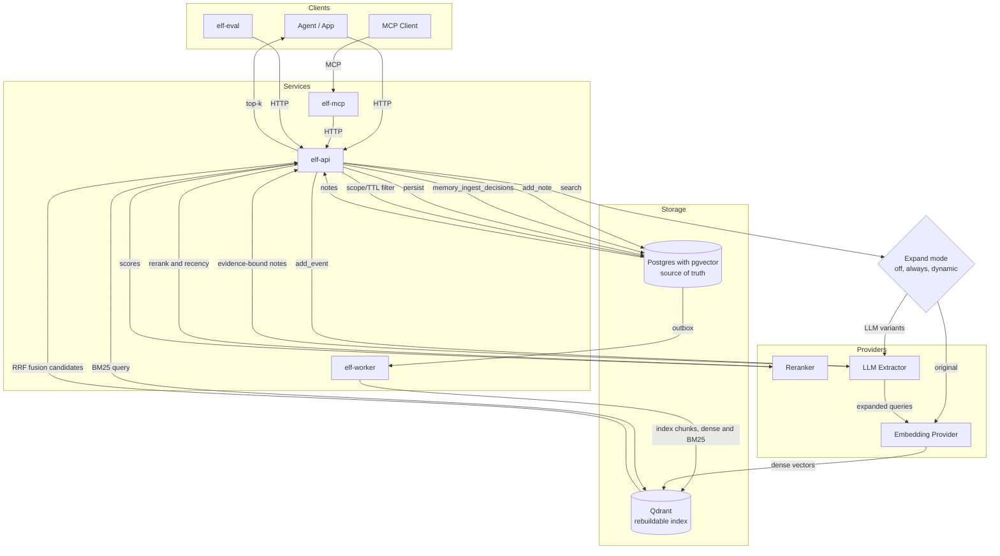

<div align="center">

# ELF

Evidence-linked fact memory for agents.

[](https://www.gnu.org/licenses/gpl-3.0)
[](https://github.com/hack-ink/ELF/actions/workflows/language.yml)
[](https://github.com/hack-ink/ELF/actions/workflows/release.yml)
[](https://github.com/hack-ink/ELF/tags)
[](https://github.com/hack-ink/ELF)
[](https://github.com/hack-ink/ELF)

</div>

## What Is ELF?

ELF is a memory service for LLM agents that stores short, evidence-linked facts and retrieves them with chunk-first hybrid search. Postgres with pgvector is the source of truth for notes and embeddings. Qdrant is a derived, rebuildable index for fast candidate retrieval. ELF can also persist evidence-bound entity/relation facts and optionally attach them as `relation_context` in search explain output. ELF exposes both HTTP and MCP interfaces.

## Project Goals

- Improve effective context usage with compact memory retrieval instead of replaying long history.
- Preserve correctness over time with update and lifecycle semantics, not append-only memory.
- Keep memory behavior auditable with deterministic boundaries, evidence, and replayable traces.
- Enable safe multi-agent collaboration through explicit scopes and sharing controls.
- Make quality measurable with repeatable evaluation and regression checks.

## Why Choose ELF

- Evidence-linked memory with strict provenance requirements.
- Deterministic `add_note` and LLM-driven `add_event` separation.
- Postgres source-of-truth plus rebuildable retrieval index.
- Chunk-first hybrid retrieval with expansion and rerank controls.
- Multi-tenant scoped APIs for service-style integration.
- Evaluation tooling (`elf-eval`) for retrieval quality and replay analysis.

## Quickstart

Use the canonical setup guide:

- `docs/guide/getting_started.md`
- For single-user production operation, backup, restore, and Qdrant rebuild, use
  [docs/guide/single_user_production.md](docs/guide/single_user_production.md).

Fast path:

```sh
docker compose -f docker-compose.yml up -d postgres qdrant

# Terminal 1
cargo run -p elf-api -- -c config/local/elf.docker.toml

# Terminal 2
cargo run -p elf-worker -- -c config/local/elf.docker.toml

# Terminal 3
curl -fsS http://127.0.0.1:51892/health
```

For provider-backed development, copy `elf.example.toml` to `elf.toml` and fill the provider blocks.
For production use, do not rely on these quickstart commands; follow the single-user
production runbook linked above so backup, restore, rollback, and provider config
handling are explicit.

## Architecture


```mermaid
flowchart TB
  subgraph Clients
    Agent[Agent / App]
    MCPClient[MCP Client]
    Eval[elf-eval]
  end

  subgraph Services
    API[elf-api]
    MCP[elf-mcp]
    Worker[elf-worker]
  end

  subgraph Storage
    PG[(Postgres with pgvector<br/>source of truth)]
    Qdrant[(Qdrant<br/>rebuildable index)]
  end

  subgraph Providers
    Embed[Embedding Provider]
    Rerank[Reranker]
    Extractor[LLM Extractor]
  end

  Agent -->|HTTP| API
  MCPClient -->|MCP| MCP
  MCP -->|HTTP| API
  Eval -->|HTTP| API

  API -->|add_note| PG
  API -->|memory_ingest_decisions| PG
  API -->|add_event| Extractor
  Extractor -->|evidence-bound notes| API
  API -->|persist| PG
  PG -->|outbox| Worker
  Worker -->|index chunks, dense and BM25| Qdrant

  API -->|search| Expand{Expand mode<br/>off, always, dynamic}
  Expand -->|original| Embed
  Expand -->|LLM variants| Extractor
  Extractor -->|expanded queries| Embed
  Embed -->|dense vectors| Qdrant
  API -->|BM25 query| Qdrant
  Qdrant -->|RRF fusion candidates| API
  API -->|scope/TTL filter| PG
  PG -->|notes| API
  API -->|rerank and recency| Rerank
  Rerank -->|scores| API
  API -->|top-k| Agent
```

## Comparison

### Checked-In Live Benchmark Snapshot

The June 9, 2026 Docker-only live baseline uses the same generated corpus and query
manifest across ELF and the external memory projects below. ELF was run with the
production embedding provider path, `Qwen3-Embedding-8B`, and 4096-dimensional
embeddings.

- ELF production-provider stress run: 480 documents, 16 queries, `8/8` encoded checks,
  `retrieval_pass`, and `pass` in 1163 seconds.
- All-project smoke run: ELF and qmd passed every encoded check. agentmemory passed
  same-corpus retrieval but failed or could not complete lifecycle checks. mem0,
  memsearch, and claude-mem returned wrong same-corpus retrieval results in the encoded
  smoke. OpenViking was `incomplete` because its local embedding dependency could not
  complete in the Docker runner.
- The benchmark runner and report publisher are checked in and Docker-isolated:
  `cargo make baseline-live-docker`, `cargo make baseline-backfill-docker`,
  `cargo make baseline-live-report`, and `cargo make baseline-live-docker-clean`.

Detailed evidence and interpretation:

- [Live Baseline Benchmark Report - June 9, 2026](docs/guide/benchmarking/2026-06-09-live-baseline-report.md)
- [Synthetic Production Corpus Benchmark Report - June 9, 2026](docs/guide/benchmarking/2026-06-09-production-corpus-report.md)
- [Live Baseline Benchmark Runbook](docs/guide/benchmarking/live_baseline_benchmark.md)
- [Single-User Production Runbook](docs/guide/single_user_production.md)

Quick comparison snapshot (objective/high-level).
This table compares capability coverage, not overall project quality.

| Capability | ELF | agentmemory | OpenViking | mem0 | qmd | claude-mem | memsearch |
| ---------- | --- | ----------- | ---------- | ---- | --- | ---------- | --------- |
| Local-first self-hosted workflow | ✅ | ✅ | ✅ | ✅ (OpenMemory) | ✅ | ✅ | ✅ |
| MCP integration | ✅ | ✅ | — | ✅ (OpenMemory) | ✅ | ✅ | ⚠️ |
| CLI-first developer workflow | — | ✅ | ✅ | — | ✅ | ⚠️ | ✅ |
| HTTP API service surface | ✅ | ✅ | ✅ | ✅ | ⚠️ (MCP Streamable HTTP) | ✅ | — |
| Query expansion or query rewriting | ✅ | ⚠️ | ✅ | ⚠️ | ✅ | — | — |
| LLM reranking stage | ✅ | ⚠️ | ⚠️ | ⚠️ | ✅ | — | — |
| Hybrid dense + sparse retrieval | ✅ | ✅ | ✅ | ⚠️ | ✅ | ✅ | ✅ |
| Progressive disclosure style retrieval | ✅ | ⚠️ | ✅ | — | — | ✅ | ⚠️ |
| Evidence-bound memory writes | ✅ | — | — | — | — | — | — |
| Deterministic and LLM-ingestion boundary | ✅ | ⚠️ | ⚠️ | ⚠️ | — | — | — |
| Source-of-truth + rebuildable derived index | ✅ | ⚠️ | ✅ | ⚠️ | ⚠️ | ⚠️ | ✅ |
| Hierarchical/recursive retrieval strategy | ⚠️ (in progress) | ⚠️ | ✅ | ⚠️ | ⚠️ | ⚠️ | ⚠️ |
| Progressive context loading (L0/L1/L2 style) | ⚠️ (in progress) | ⚠️ | ✅ | ⚠️ | — | ⚠️ | — |
| Built-in web memory inspector/viewer | ✅ | ✅ | — | ✅ (OpenMemory) | — | ✅ | — |
| Hosted managed option | — | — | — | ✅ | — | — | — |
| Multi-tenant scope semantics | ✅ | ⚠️ | ⚠️ | ✅ | — | — | — |
| TTL/lifecycle policy controls | ✅ | ⚠️ | ⚠️ | ✅ | — | ⚠️ | — |
| Graph memory mode | ⚠️ (graph-lite: structured relations persisted; optional search `relation_context`) | ⚠️ | ⚠️ (URI-link relations) | ✅ (optional) | — | — | — |

Legend: `✅` built-in and documented; `⚠️` partial, optional, or in-progress; `—` not a first-class documented capability.

Project signature strengths (what each does especially well):

| Project | Signature strengths | Potential ELF adoption value |
| ------- | ------------------- | ---------------------------- |
| ELF | Evidence-bound writes, deterministic ingestion boundary, SoT + rebuildable index, eval tooling | Keep as core differentiators while extending retrieval and UX |
| agentmemory | Cross-agent hooks, MCP/REST packaging, local viewer, iii console observability, coding-agent continuity benchmarks | Use as adapter/baseline and UX reference, not a replacement for ELF provenance semantics |
| OpenViking | Filesystem-like context model (`viking://`), hierarchical retrieval, staged retrieval trajectory | Improve query planning, recursive retrieval, and explainable stage outputs |
| mem0 | Broad ecosystem (SDK + hosted + OpenMemory), multi-entity scope, lifecycle + optional graph memory | Strengthen event/history APIs and additive graph context channel |
| qmd | High-quality local retrieval pipeline (query expansion + weighted fusion + rerank), strong CLI/MCP workflow | Borrow transparent routing/fusion knobs and local debugging ergonomics |
| claude-mem | Progressive disclosure UX, automatic capture loop, practical local viewer/inspection workflow | Add operator-facing viewer/status/trace surfaces for faster tuning |
| memsearch | Markdown-first canonical store, incremental reindex, practical hybrid retrieval | Reinforce ingest/index consistency and developer-friendly local workflows |

Detailed comparison, mechanism-level analysis, and source map:

- [Live Baseline Benchmark Report - June 9, 2026](docs/guide/benchmarking/2026-06-09-live-baseline-report.md)
- [Synthetic Production Corpus Benchmark Report - June 9, 2026](docs/guide/benchmarking/2026-06-09-production-corpus-report.md)
- [Live Baseline Benchmark Runbook](docs/guide/benchmarking/live_baseline_benchmark.md)
- [External Memory Improvement Plan](docs/guide/research/external_memory_improvement_plan.md)
- [Detailed External Comparison](docs/guide/research/comparison_external_projects.md)
- [Research Projects Inventory](docs/guide/research/research_projects_inventory.md)
- [Agent Memory Selection Research Run](docs/research/2026-06-08-agent-memory-selection.json)

Latest external research refresh: June 8, 2026.

## Documentation

- Start here: `docs/index.md`
- Operational guide index: `docs/guide/index.md`
- Single-user production runbook:
  [docs/guide/single_user_production.md](docs/guide/single_user_production.md)
- Benchmarking guides and reports: `docs/guide/benchmarking/index.md`
- Research index: `docs/guide/research/index.md`
- Specifications: `docs/spec/index.md`
- System contract: `docs/spec/system_elf_memory_service_v2.md`
- Ingest policy: `policy_decision` values (`remember`, `update`, `ignore`, `reject`) are returned for each note result in `add_note` and `add_event`.
- All ingest decisions are also written to `memory_ingest_decisions` with policy inputs and thresholds for auditability.
- Evaluation guide: `docs/guide/evaluation.md`
- Integration testing: `docs/guide/integration-testing.md`

## Development

```sh
cargo make fmt
cargo make lint
cargo make test
```

For integration and E2E workflows, use `docs/guide/getting_started.md` and `docs/guide/integration-testing.md`.

## Support Me

If you find this project helpful and would like to support its development, you can buy me a coffee!

Your support is greatly appreciated and motivates me to keep improving this project.

- **Fiat**
    - [Ko-fi](https://ko-fi.com/hack_ink)
    - [Afdian](https://afdian.com/a/hack_ink)
- **Crypto**
    - **Bitcoin**
        - `bc1pedlrf67ss52md29qqkzr2avma6ghyrt4jx9ecp9457qsl75x247sqcp43c`
    - **Ethereum**
        - `0x3e25247CfF03F99a7D83b28F207112234feE73a6`
    - **Polkadot**
        - `156HGo9setPcU2qhFMVWLkcmtCEGySLwNqa3DaEiYSWtte4Y`

Thank you for your support!

## Appreciation

We would like to extend our heartfelt gratitude to the following projects and contributors:

- The Rust community for their continuous support and development of the Rust ecosystem.

## Additional Acknowledgements

- None.

<div align="right">

### License

<sup>Licensed under [GPL-3.0](LICENSE).</sup>

</div>
